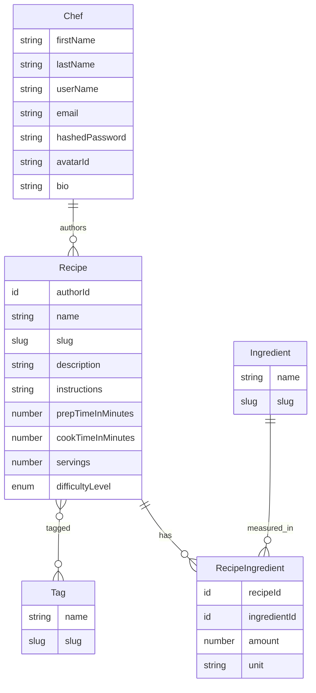

# Análise de regras de negócio — Cookbook

> **Objetivo deste documento:** registrar as regras de negócio do produto (entidades, invariantes, decisões de domínio) como referência estável para implementação.  
> **Complemento técnico:** o [plano de melhorias de fundação](plano-melhorias-fundacao.md) cobre correções e padrões de engenharia (MF-XX); este documento cobre **o quê** o produto deve fazer, não **como** refatorar o código.

Premissa do produto (README): **Fase 1 = caderno pessoal com busca excelente**; **Fase 2 = rede leve de chefs**. As recomendações abaixo respeitam essa ordem.

---

## Modelo atual (o que o domínio já expressa)

Capacidades de negócio hoje: registrar/autenticar chef, editar próprio perfil, criar/editar própria receita (com tags e ingredientes medidos), ler receita por id. **Não há** listagem, busca, exclusão, privacidade nem social.

---

## Avaliação por entidade

### Chef — adequado para Fase 1 e 2 leve

Carrega identidade de conta + perfil mínimo (`firstName`, `lastName`, `userName`, `email`, `hashedPassword`, `avatarId`, `bio`). Isso é o certo para “cada usuário é um Chef”.

**Manter.** Não acrescentaria campos sociais agora (followers, stats).

**Regras de negócio ainda frouxas (vale explicitar no domínio, não só no Prisma):**

- Unicidade de `email` (já no register) **e** de `userName` (só no schema hoje)
- Em edição: impedir colisão de email/username com outro chef
- Avatar ainda é stub — ok adiar storage; regra: `avatarId` opcional

### Recipe — núcleo bom para o caderno pessoal

Campos de conteúdo (`name`, `description`, `instructions`, tempos, `servings`, `difficultyLevel`) + `authorId` + `slug` cobrem bem o “guardar e filtrar depois”.

**Manter esse núcleo.** É alinhado ao README (filtros por tempo, dificuldade, etc.).

**Ajustes de regra (produto), não de engenharia:**

| Tema | Situação | Recomendação |
|------|----------|--------------|
| Tags | Lista de IDs; find-or-create | Opcionais — **manter** |
| Ingredientes | Via `RecipeIngredient` (amount + unit) | Obrigatórios na prática de uso (mín. 1) — **explicitar** |
| `instructions` | Texto livre | **Manter** na Fase 1; steps estruturados só se a busca/UX pedir |
| `slug` | Gerado no create; não atualiza no rename | Slug estável após create; URL pública `{id}-{slug}` como o README já sugere |
| Defaults | `prep/cook = 0`, `servings = 1` se omitidos | Preferir `null` = “não informado” e `0` só se for valor real; evita filtro “tempo 0” mentiroso |
| Autoria | Edit só pelo autor | **Manter**; create deve sempre amarrar `authorId` ao ator autenticado |
| Visibilidade | Tudo público na leitura | Fase 1 pessoal: aceitável; antes da rede, decidir `private \| public` (ou draft) |

### Ingredient + RecipeIngredient — modelo N:N correto

- **Ingredient** = catálogo global (`name` + `slug`), compartilhado entre receitas
- **RecipeIngredient** = linha da receita (`amount`, `unit`) — relação com dados

Isso é exatamente o que o produto descreve (“ingredientes com inúmeras receitas”). **Não tiraria.**

**Acrescentaria / trocaria (regras):**

- Tratar `RecipeIngredient` como **entidade filha do agregado Recipe** (tem identidade para sync de edição) — não como VO puro
- `unit`: começar com vocabulário controlado (enum ou lista fechada: `g`, `kg`, `ml`, `l`, `xícara`, `colher_sopa`, `unidade`, …), não string livre infinita
- Find-or-create por nome normalizado: **manter** (essencial para filtro “tem tomate”)
- Não virar “estoque de despensa” na Fase 1

### Tag — modelo N:N correto; tags opcionais ok

Mesmo padrão de catálogo global + associação na receita. **Manter tags opcionais.**

Find-or-create por nome normalizado é bom para descoberta e evita explosão de sinônimos óbvios (`Café da Manhã` vs `cafe da manha`).

---

## Categorias fixas vs tags — veredito

**Não criar entidade `Category` nem N:N categoria na Fase 1.** Tags já cumprem o papel de classificação flexível.

Motivos:

1. Exemplos como “café da manhã / almoço / jantar” (ocasião da refeição) e “massa / sopa / doce” (tipo de prato) misturam **dois eixos**. Uma única categoria fixa força escolha falsa ou categorias que não cabem juntas.
2. Categoria fixa = migração + UI rígida sempre que a taxonomia mudar; tags crescem com o uso.
3. Complexidade extra (enum, seed, validação, filtros dedicados) compete com o que o README prioriza: **busca com filtros**.

**Como ter o melhor dos dois mundos sem nova entidade:**

- Tags livres do usuário (opcionais)
- **Seed / sugestões** de tags canônicas no produto (não no modelo como aggregate separado), ex.: `cafe-da-manha`, `almoco`, `jantar`, `massa`, `sopa`, `doce`
- Na UI: chips sugeridos + campo livre
- Na busca: filtro `tags[]` (e depois “qualquer / todas”)

**Só introduzir categoria fixa depois** se aparecer necessidade clara de navegação tipo “hub” com **uma** dimensão obrigatória e exclusividade (ex.: “toda receita deve ter exatamente um meal course”). Até lá, tags bastam.

Se no futuro quiser um pouco de estrutura sem Category entity: no máximo **um** campo enum opcional na Recipe (ex.: `mealOccasion`), não uma taxonomia paralela completa.

---

## O que acrescentaria (regras de negócio), por fase

### Fase 1 — caderno + busca (prioridade de produto)

Regras que o domínio ainda não expressa mas o README promete:

1. **Listar / buscar receitas** do chef (e depois globais): filtros por ingredientes, tags, tempo total (prep+cook), dificuldade, nome
2. **Excluir receita** (só autor)
3. **Ingredientes: pelo menos um** na create/edit (ou warning forte de produto — preferível invariante)
4. **Unicidade de `userName`** no register/edit
5. **Unidades controladas** em `RecipeIngredient`
6. (Opcional perto da Fase 2) **`visibility`**: private default no caderno pessoal → public quando for compartilhar

Não acrescentaria agora: comentários, likes, follow, remix, meal plan, nutrição, moderação.

### Fase 2 — rede leve (só depois da busca)

Em cima do Chef/Recipe atuais:

- Perfil público por `userName` + lista de receitas públicas
- Salvar/favoritar receita de outro chef (nova relação `Chef`–`Recipe`, não poluir Recipe)
- Feed simples (cronológico de públicos / de quem sigo) — **depois** de favorite + visibility

---

## O que tiraria ou não colocaria

| Ideia | Decisão |
|-------|---------|
| Entidade Category N:N agora | **Não** |
| Steps/ingredientes como agregados separados do Recipe | **Não** — filhos do agregado Recipe |
| Tags obrigatórias | **Não** — opcionais |
| Duplicar “categoria” e tag com o mesmo significado | **Não** |
| Social (follow/like/comment) antes de busca | **Adiar** — README já manda |

---

## O que trocaria (clareza de regra, não de stack)

1. **Defaults de tempo/porções** → `null` quando não informado
2. **Slug** → estável após create; URL pública `{id}-{slug}`
3. **`RecipeIngredient`** → entidade do agregado (não VO); sync create/update/delete na edição da receita (regra: a lista enviada **substitui** o conjunto da receita)
4. **Tags na edição** → omitir = não mexer; enviar lista = substituir conjunto (regra de negócio; ver MF-09 no plano técnico para alinhar implementação)

---

## Veredito geral

O modelo de negócio **já está bem encaminhado** para o produto descrito: Chef autor, Recipe com metadados de cozinha, catálogos globais de Ingredient/Tag, join medido de ingredientes, tags opcionais. Isso é o coração certo da Fase 1.

Os buracos principais **não** são “falta Category”, e sim:

- **regras de busca/listagem** (razão de ser do app)
- **invariantes** (autoria no create, username único, ≥1 ingrediente, unidades)
- **ciclo de vida** (delete, substituição clara de tags/ingredientes na edit)
- **adiar social e taxonomia rígida** até o caderno filtrável funcionar

Categorias fixas: **não agora**; use tags + seeds/sugestões. Reavalie Category só se a UX de navegação exigir exclusividade estruturada.
