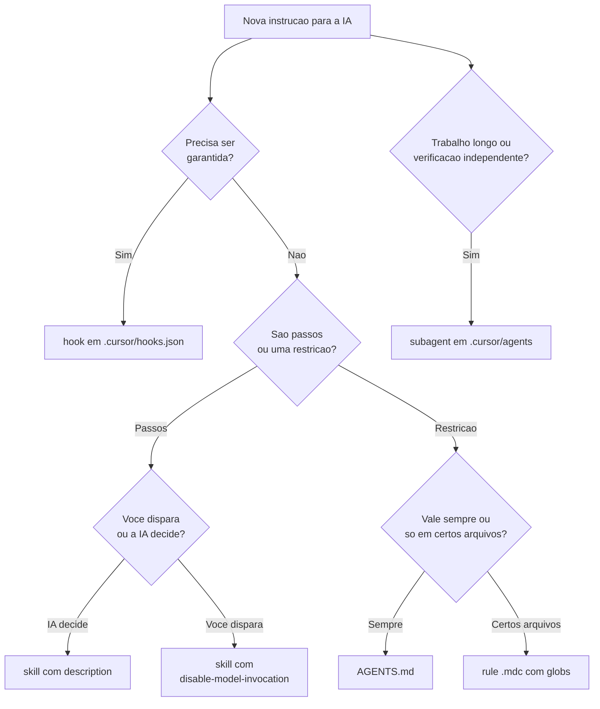

# Guia dos utilitários de IA — Cookbook

Documento para **humano**. Responde duas perguntas diferentes:

- **Como eu uso a IA** numa tarefa real (§1) — implementar uma regra, planejar refatoração, analisar arquitetura.
- **Como e quando eu crio** um utilitário novo (§2 a §5) — rule, skill, subagent, hook.

O agente não precisa ler este arquivo: a superfície dele é `AGENTS.md` e `.cursor/`.

Um arquivo só, de propósito. A parte útil é a **comparação entre primitivos**; fragmentar em `guia-rules.md` / `guia-skills.md` destruiria exatamente isso, e reproduziria em `docs/` o problema que a reorganização do `.cursor/` corrigiu.

Token e progressive disclosure valem para o que o agente carrega. Guia de humano não paga aluguel de contexto.

---

## 1. Como usar a IA — receitas

### 1.0 Escolha o modo antes do prompt

O modo decide o que a IA **pode** fazer. Errar o modo é o erro mais caro: análise em Agent mode vira refatoração não pedida.

| Quero | Modo | O que acontece |
|-------|------|----------------|
| Entender, decidir, comparar abordagens | **Plan** (Shift+Tab no input) | Pesquisa o código, faz perguntas, produz plano revisável. Não edita. |
| Executar algo já decidido | **Agent** | Edita, roda comandos, delega a subagents, dispara hooks. |
| Uma pergunta pontual sobre o código | **Ask** | Leitura, sem edição. |
| Bug com comportamento inesperado | **Debug** | Investigação com evidência de runtime. |

Plano de Plan mode é salvo no seu diretório home por padrão. “Save to workspace” move para o repo — só faça isso se o plano merece virar registro versionado.

**Dois tipos de plano no Cookbook, não confunda:**

| | Plano MF-XX | Plano de sessão |
|---|---|---|
| Onde | `docs/plans/mf-XX-*.md` (versionado) | Home do Cursor (`~/.cursor/plans/`), descartável |
| Assunto | Regra de **negócio** / produto | Refatoração técnica, reorganização, migração |
| Como criar | `/write-mf-plan` | Plan mode |
| Fim de vida | `git mv` para `docs/plans/completed/` | Some quando a execução termina |

### 1.1 Implementar uma regra de negócio nova

Exemplo real: MF-14, filtro `difficultyLevel` (item 12.g das regras de negócio).

**Passo 1 — a regra existe?** Abra `docs/regras-de-negocio.md`. Se a regra ainda não foi decidida ali, **não peça código**: você vai receber uma invenção plausível. Decida o produto primeiro — §3 e §4 **daquele** documento, não deste guia.

**Passo 2 — existe plano?** Procure em `docs/plans/`. Se não, gere:

```
/write-mf-plan MF-14 — filtro difficultyLevel (item 12.g). Precedente: MF-28 (ingredients[]).
```

`write-mf-plan` é manual (`disable-model-invocation: true`), então precisa do `/`. Revise o plano antes de implementar — corrigir escopo em Markdown é mais rápido que reverter código.

**Passo 3 — implementar.** Agent mode, prompt curto, apontando o plano:

```
implementa o @docs/plans/mf-14-filtro-difficulty-level.md
```

Não cole convenções no prompt. Elas já chegam: `AGENTS.md` está sempre no contexto, `create-use-case` entra pela description, e `domain-layer` / `infra-layer` / `test-pyramid` anexam por glob quando ele abre os arquivos. Repetir cria uma segunda fonte que vai divergir.

Trabalho multi-arquivo em `src/domain` ou `src/infra` deve cair no `backend-engineer` sozinho. Se não caiu e você quer o contexto isolado, peça: `delega ao backend-engineer`.

**Passo 4 — verificar com outro agente.** O `verifier` roda a sequência sem `--fix`, é `readonly` e relata:

```
verifica o que foi implementado
```

Quem escreveu o código tem viés de confirmação. Não pergunte “está tudo verde?” para o implementador — ele já disse que sim.

**Passo 5 — fechar.** Atualizar `docs/regras-de-negocio.md` §5 (linha do backlog) e §6 (roadmap), e mover o plano:

```bash
git mv docs/plans/mf-14-*.md docs/plans/completed/
```

Este passo está sendo esquecido de verdade: MF-16 (`deletedAt`), MF-20 (`Slug`) e MF-28 (`ingredientMatch`) estão implementados no código e os planos continuam em `docs/plans/`, fora de `completed/`. O passo existe na skill `write-mf-plan` (seção *Completing a plan*) — mas ninguém invoca a skill na hora de concluir. Ver §5.2, é um bom candidato a utilitário novo.

### 1.2 Planejar uma refatoração

Refatoração não é regra de negócio, então **não** é MF-XX nem vai para `docs/regras-de-negocio.md`. Use Plan mode.

Exemplo real: os filtros de busca estão crescendo em três lugares ao mesmo tempo — `search-recipes-params.ts`, o `where` do `prisma-recipes-repository.ts` e o espelho in-memory. Com os 7 filtros restantes do MF-14, isso dobra.

Prompt de Plan mode que funciona:

```
Quero um plano de refatoração para a composição de filtros da busca.

Objetivo: adicionar um filtro novo deve tocar um lugar, não três
(params VO, where do Prisma, in-memory).

Antes de propor: diagnostique com evidência (arquivo:linha) como está hoje
em search-recipes-params.ts, prisma-recipes-repository.ts e o in-memory.

Restrições: domínio não importa de infra; os filtros restantes do MF-14
(12.e a 12.l) entram depois; não quebrar os specs de MF-27 e MF-28.

Quero: etapas ordenadas, "pronto quando" por etapa, e o que fica fora de escopo.
```

O que faz um plano ser bom:

1. **Objetivo e restrição, não solução.** Se você já escreveu a solução no prompt, não precisava do plano.
2. **Diagnóstico com evidência antes da proposta.** `arquivo:linha`. Plano sem diagnóstico é chute formatado.
3. **“Pronto quando” por etapa.** Critério verificável, não “refatorado”.
4. **Fora de escopo explícito.** É o que impede a refatoração de virar reescrita.
5. **Ordem.** Diga o que é inseparável (ex.: mover um fato exige apagar a origem no mesmo commit).

Se a execução sair diferente do combinado, reverta e refine o **plano** — sai mais limpo e mais rápido que corrigir por prompts em cima de código torto.

Se o plano merece virar registro do repo (decisão que alguém vai questionar em seis meses), use “Save to workspace” e coloque em `docs/plans/`. Foi o caso da reorganização do `.cursor/` que produziu este guia.

### 1.3 Fazer uma análise arquitetural

Regra número um: **modo read-only** (Plan ou Ask). Em Agent mode, o pedido “analisa as camadas” termina com arquivos editados.

Regra número dois: pergunta auditável. “O código está bom?” não é analisável — devolve elogios. Ancore num invariante que existe:

| Pergunta | Ancorada em |
|----------|-------------|
| Algum arquivo de `src/domain` importa de `src/infra`? | Invariante do `AGENTS.md` / `domain-layer.mdc` |
| Quais ports têm método que só o Prisma usa? | Interface segregation (`domain-layer.mdc`) |
| Quais use cases têm branch de `Either` sem cobertura no spec? | `test-pyramid.mdc` |
| Todo grafo de agregado é persistido em transação no repositório? | `infra-layer.mdc` |
| O que a §5 das regras de negócio marca ✅ está de fato no código? | `docs/regras-de-negocio.md` |

Prompt:

```
Análise, sem editar nada.

Pergunta: algum arquivo em src/domain importa de src/infra, direta ou
indiretamente?

Para cada achado: arquivo:linha, o invariante violado (cite AGENTS.md ou a
rule de camada) e o custo de corrigir. Se não houver achado, diga isso —
não invente melhorias.
```

Três coisas ajudam:

- **Peça evidência, não opinião.** `arquivo:linha` + a regra violada. Sem isso você não consegue conferir e a análise vale zero.
- **Deixe a coleta para o subagent `explore`** (embutido no Cursor). Ele varre em contexto isolado e devolve só o resultado — o seu chat não enche de listagem de busca.
- **Autorize o “nada a relatar”.** Sem essa cláusula, o modelo preenche o vazio.

E decida antes onde a saída mora, senão a análise evapora:

| A análise produziu | Vai para |
|--------------------|----------|
| Regra que vale para sempre | Invariante no `AGENTS.md` ou rule de camada (§2) |
| Lista de correções | Plano de refatoração (§1.2) |
| Só entendimento | Nada. O transcript basta. |
| Diagnóstico que alguém vai contestar | `docs/` — como este guia |

### 1.4 Investigar um teste vermelho

Rode o `verifier` primeiro: você quer a saída real do comando, não a interpretação de quem escreveu o código. Ele já distingue falha de e2e por **falta de Postgres** (ambiente) de falha por defeito — não saia consertando código por causa de banco desligado.

Depois disso, Debug mode com o erro colado. Um erro por vez; “conserta os 4 testes” costuma virar quatro remendos.

### 1.5 Revisar o que a IA escreveu

Duas perguntas distintas, dois utilitários:

| Pergunta | Use |
|----------|-----|
| “Está verde?” (lint, typecheck, build, testes) | `verifier` |
| “Tem bug ou regressão?” | `/review-bugbot` (embutido) |
| “Tem risco de segurança?” | `/review-security` (embutido) |

O `stop` hook já garante que o turno não termina com erro de tipo. Isso não substitui revisão: typecheck verde não diz nada sobre a regra estar certa.

### 1.6 Anti-receitas

- **Colar o `AGENTS.md` (ou convenções) no prompt.** Já está no contexto. A cópia diverge e vira segunda fonte da verdade.
- **Pedir implementação e verificação no mesmo turno ao mesmo agente.** Ele valida a própria narrativa.
- **“Implementa o MF-14 inteiro”** — 7 filtros num turno. MF-27 e MF-28 foram um filtro por plano, por isso deram certo. Fatie.
- **Análise arquitetural em Agent mode.** Vira refatoração não pedida.
- **Citar a skill no prompt sempre** (“usa a skill create-use-case”). Se você precisa citar, a `description` está ruim. Conserte a description (§4), não o prompt.
- **Confiar no ✅ do backlog.** Confira o código. MF-16, MF-20 e MF-28 mostram que o registro atrasa em relação ao repositório.
- **Pedir código para regra que não existe nas regras de negócio.** Você recebe uma invenção coerente, que é o pior tipo de erro.

---

## 2. Qual primitivo usar

Daqui em diante o assunto é **criar** utilitário, não usar.

Um primitivo por natureza de instrução. Se a mesma frase cabe em dois itens abaixo, ela está mal formulada — quebre em duas.



| Precisa de… | Primitivo | Por quê |
|-------------|-----------|---------|
| Fato estável em **todo** turno (stack, comandos, layout, invariantes) | `AGENTS.md` | Sempre no contexto; sem frontmatter; lido também por outras ferramentas |
| Restrição só quando certos arquivos estão em jogo | Rule `.mdc` com `globs` | Anexa automaticamente; some quando o glob não casa |
| Sequência de passos que a IA deve seguir sozinha | Skill (sem `disable-model-invocation`) | O agente lê a `description` e abre o `SKILL.md` |
| Sequência que **você** dispara (`/nome`) | Skill com `disable-model-invocation: true` | Não compete com o catálogo automático |
| Trabalho longo, paralelo, ou checagem cética em contexto limpo | Subagent em `.cursor/agents/` | Janela isolada; o pai só vê o relatório |
| Comportamento que o modelo **não pode** ignorar | Hook | Script no evento; não gasta raciocínio |

Regra dura do Cookbook: **nada com `alwaysApply: true` além do `AGENTS.md`.** Rule always-on compete com o `AGENTS.md`, duplica e vence o resumo lossy — foi o que aconteceu com `cookbook-engineering.mdc`.

---

## 3. Os primitivos, um a um

### 3.1 `AGENTS.md`

Arquivo Markdown na raiz, **sem frontmatter**. O Cursor (e Codex, Copilot, Gemini CLI, etc.) injeta no começo do contexto do agente. Nested `AGENTS.md` em subpastas combinam com o da raiz; o Cookbook tem só o da raiz.

**O que dispara:** todo turno de Agent no repositório. Não depende de arquivo aberto nem de `@`.

**O que entra:** fatos que valem em qualquer edição — stack, comandos reais do `package.json`, layout das camadas, invariantes de arquitetura, ponteiros para docs canônicos.

**O que não entra:** pirâmide de testes, tabela de factories, checklist de PR, SOLID comentado, `DifficultyLevel`, rotas públicas. Isso vive em rule com glob ou em skill.

Convenções de código **não** ficam no `README.md`. O README aponta para o `AGENTS.md`; o agente não é instruído a abrir o README.

### 3.2 Rules (`.cursor/rules/*.mdc`)

Só extensão `.mdc`. Um `.md` nesta pasta é ignorado em silêncio — não tem frontmatter (`description`, `globs`, `alwaysApply`).

Frontmatter (os três campos definem o modo):

```yaml
---
description: >-
  Uma linha no formato "faz X. Use when Y".
globs: "src/domain/**"
alwaysApply: false
---
```

| `alwaysApply` | `description` | `globs` | Comportamento |
|---------------|---------------|---------|---------------|
| `true` | — | — | Sempre no contexto. **Proibido neste repo.** |
| `false` | — | preenchido | Anexa quando um arquivo que casa está em contexto |
| `false` | preenchida | omitido | O agente decide pela description (“Apply Intelligently”) |
| `false` | omitida | omitido | Só com `@nome` no chat |

O Cookbook usa só o segundo modo: `alwaysApply: false` + `globs`. A `description` existe para o picker e para o agente saber o que é a rule, mas o disparo é o glob.

**O que dispara:** arquivo em contexto cujo caminho casa com `globs`. Abrir um controller anexa `infra-layer`; abrir um `.spec.ts` anexa `test-pyramid`; abrir um `.env` não anexa nada.

Globs múltiplos: vírgula, como na doc do Cursor (`**/*.spec.ts, **/*.e2e-spec.ts`).

Corpo curto, restritivo, com exemplos concretos. Apontar para arquivo canônico em vez de colar código.

### 3.3 Skills (`.cursor/skills/<name>/SKILL.md`)

Pasta cujo nome **é** o `name` do frontmatter, contendo `SKILL.md`. O Cookbook usa só `.cursor/skills/` (o Cursor também descobre `.agents/skills/`, `~/.cursor/skills/`, e pastas Claude/Codex).

Frontmatter:

```yaml
---
name: create-use-case          # idêntico ao nome da pasta
description: >-
  Faz X. Use when Y (e gatilhos em PT se o time pede em PT).
disable-model-invocation: true # omitir para auto-invocação
---
```

| Campo | Obrigatório | Papel |
|-------|-------------|--------|
| `name` | sim | Identificador; minúsculas, números, hífens; **igual à pasta** |
| `description` | sim | Catálogo: o agente decide relevância por ela (máx. 1024 chars) |
| `disable-model-invocation` | não | `true` = só com `/nome` ou `@`; o agente não puxa sozinho |
| `paths` | não | Escopo por glob (o Cookbook não usa) |

**O que dispara (auto):** a `description` entra no catálogo de skills em todo turno. Se o pedido casa, o agente lê o `SKILL.md`. Gatilhos em português (`cria o use case`, `teste e2e`) estão nas descriptions de propósito.

**O que dispara (manual):** `/create-use-case`, `@create-use-case`, ou Custom Mode.

O corpo é **passos**, não princípios. Referências longas (tabelas) ficam em `references/` e o `SKILL.md` linka — o agente só abre quando o passo pede. Esse é o progressive disclosure que justifica fragmentar conteúdo **do agente**.

### 3.4 Subagents (`.cursor/agents/*.md`)

Markdown com frontmatter. Cada um vira um tipo no Task tool. Começa com **contexto limpo**: não vê o histórico do pai; o prompt da delegação precisa apontar para `AGENTS.md` e skills.

Frontmatter:

```yaml
---
name: backend-engineer
description: Implements X. Use proactively when Y.
model: inherit          # ou um id concreto, ex. composer-2.5
readonly: true          # omitir (false) se puder editar
---
```

| Campo | Padrão | Papel |
|-------|--------|--------|
| `name` | nome do arquivo | Identificador; minúsculas e hífens |
| `description` | — | O pai lê isto para decidir delegar |
| `model` | `inherit` | Mesmo modelo do pai, ou pin (ex. `composer-2.5`) |
| `readonly` | `false` | Sem editar arquivos nem shell que escreve |

**O que dispara:** o agente pai vê as descriptions e pode lançar sozinho (`Use proactively…`). Você também pode pedir explicitamente.

O Cursor já traz `Explore`, `Bash` e `Browser` embutidos. Não recrie: um subagent seu deve carregar conhecimento do Cookbook que eles não têm.

Não cole comandos nem rules no corpo — aponte. Subagent que duplica o `AGENTS.md` apodrece na hora em que um dos dois muda.

### 3.5 Hooks (`.cursor/hooks.json` + `.cursor/hooks/*.sh`)

Único primitivo **determinístico**. O modelo não escolhe se roda, e não gasta raciocínio decidindo.

Project hooks executam a partir da **raiz do repo**. Por isso o comando é `.cursor/hooks/format.sh`, não `./hooks/format.sh` (esse caminho é de hook de usuário em `~/.cursor/`).

Fail-open por padrão: exit ≠ 0 e ≠ 2 registra falha e **segue**. Exit 2 bloqueia (equivalente a `permission: "deny"`). A intenção nos hooks atuais é qualidade, não segurança — para bloquear leitura de arquivo sensível existe `failClosed: true` no `beforeReadFile`.

Cada script lê JSON no stdin e pode escrever JSON no stdout. Eventos usados aqui: `afterFileEdit` (recebe `file_path`) e `stop` (recebe `status` e `loop_count`, devolve `followup_message`).

---

## 4. Como escrever uma `description` que funciona

A `description` é o mecanismo inteiro de auto-invocação (skills, subagents, e rules “Apply Intelligently”). Sem ela boa, o arquivo existe e ninguém abre.

Formato fixo neste repo: **faz X. Use when Y.**

1. Terceira pessoa (a description vai no system prompt). Não use “I can…” / “You can…”.
2. O **quê** (capacidade concreta) e o **quando** (cenários e palavras que o usuário realmente digitaria).
3. Inclua gatilhos em português se o time pede em português (`cria o use case`, `verifique`, `plano MF`).
4. Seja específico o bastante para não competir com outra skill. “Helps with tests” não distingue `create-controller-e2e` de `test-pyramid`.

Bom (skill real):

```yaml
description: >-
  Creates a Cookbook application use case end-to-end: repository port, Either
  use case, in-memory and Prisma adapters, unit spec, HTTP controller and e2e.
  Use when adding or extending a use case, application action, or repository
  port, or when the user asks to create a use case (cria o use case, novo caso
  de uso) such as archive, publish, delete, or similar.
```

Ruim: `Cookbook engineering guidelines.` — o agente lê isso, acha que já sabe, e nunca abre o arquivo.

O mesmo formato vale para `description` de rule e de subagent. Em subagent, “Use proactively when…” é o sinal de delegação.

---

## 5. Quando criar um utilitário novo

### 5.1 Os três testes

Antes de criar qualquer arquivo, três perguntas. Se a resposta for não nas três, **escreva um prompt melhor** em vez de um utilitário.

1. **Repetição.** Você já pediu isso três vezes? Duas ainda é prompt. Três é padrão.
2. **Esquecimento.** A IA erra o mesmo ponto quando você não lembra? Isso é falta de rule ou de linha no `AGENTS.md`.
3. **Natureza.** Passos → skill. Restrição → rule (ou `AGENTS.md` se vale sempre). Garantia → hook. Contexto isolado ou verificação independente → subagent.

E o custo, que é o critério que as pessoas esquecem:

| Primitivo | Custo de contexto |
|-----------|-------------------|
| Hook | zero token — é script |
| Rule com `globs` | só quando um arquivo casa |
| Skill | a `description` é paga em **todo** turno; o corpo só quando aberta |
| Subagent | a `description` é paga em todo turno; o corpo roda em janela separada |
| `AGENTS.md` | tudo, sempre |

Empatou entre dois primitivos? Escolha o mais barato. Formatação é hook, não rule — a IA nem precisa saber que existe.

### 5.2 Candidatos reais no Cookbook

Não hipóteses: cada um abaixo vem de uma lacuna que existe hoje no repositório.

**Skill — `add-search-filter`** (o mais forte). O MF-14 tem 7 filtros restantes (12.e `excludeIngredients`, 12.f `tags`/`tagMatch`, 12.g `difficultyLevel`, 12.h `maxTotalTimeInMinutes`, 12.i `authorUserName`, 12.j `sortBy`, 12.l `minServings`). O contrato já existe: `SearchRecipesCatalogFilters` em `search-recipes-params.ts` declara todos eles, e `normalizeCatalogFilters` / `hasCatalogFilters` já os tratam. O que repete por filtro é a ligação: `where` no `prisma-recipes-repository.ts`, filtragem espelhada em `test/repositories/in-memory-recipes-repository.ts`, query param Zod no `search-recipes.controller.ts`, spec unit e e2e. MF-27 (`query`) e MF-28 (`ingredients[]`) já percorreram esse caminho duas vezes. Passa nos três testes: repetição (7 pendentes), natureza (passos ordenados), e `create-use-case` não serve porque não há port nem use case novo. Auto-invocável, com gatilho “filtro de busca”.

**Skill — `add-prisma-migration`**. Toda mudança de schema repete: editar `prisma/schema.prisma`, `pnpm prisma migrate dev` com nome descritivo, atualizar mapper e `enum-mappers.ts`, atualizar factory. Precedentes: `add_recipe_deleted_at`, `add_measurement_unit_enum`, `add_recipe_ingredient_position_and_note`. Candidato sólido, embora menos frequente que filtros.

**Skill — `complete-mf`** (discutível, de propósito). O passo de conclusão — atualizar §5/§6 das regras de negócio e `git mv` para `completed/` — está sendo esquecido: MF-16, MF-20 e MF-28 estão no código com o plano ainda em `docs/plans/`. O procedimento **já existe** na skill `write-mf-plan` (*Completing a plan*), então criar outra skill duplica um fato — viola o padrão “um fato, um arquivo”. Duas saídas honestas: (a) invocar `/write-mf-plan` na conclusão, que é o desenho atual e depende de você lembrar; (b) extrair a conclusão para `/complete-mf` manual, e `write-mf-plan` passa a **referenciar** em vez de descrever. Hook não resolve: decidir qual linha do backlog marcar exige julgamento.

**Rule — `prisma-schema.mdc`, globs `prisma/**`**. Lacuna verificável: `infra-layer.mdc` tem `globs: "src/infra/**"`, e o schema mora em `prisma/schema.prisma`. Editar o schema hoje anexa **nenhuma** rule. As convenções de fronteira (model `User` / tabela `users` mapeados para `Chef`, enum `Easy`/`Medium`/`Hard` no Prisma vs `easy`/`medium`/`hard` no domínio, nullable de `deleted_at`, migration com nome descritivo) só chegam se o agente também abrir um arquivo de `src/infra`. Restrição escopada por caminho = rule com glob.

**Hook — `beforeShellExecution` barrando comando destrutivo de banco**. `prisma migrate reset` e `db push --force-reset` derrubam o banco de desenvolvimento. Um agente que encontra drift de migration rodando e2e tem incentivo real de “resolver” resetando. Isso não pode depender de boa vontade do modelo: é `exit 2` (deny). Natureza de garantia = hook, e o único caso deste repo em que a intenção é segurança, não qualidade.

**Hook — `beforeReadFile` com `failClosed: true` para `.env`**. O `.env` está na raiz (gitignored) com `JWT_PRIVATE_KEY`, `JWT_PUBLIC_KEY` e `DATABASE_URL`. Nada impede o agente de ler e ecoar isso num resumo. `failClosed: true` aqui é o oposto do resto: se o hook falhar, **bloqueie**.

**Hook — estender `format.sh` para `prisma/schema.prisma`**. O script atual só age em `*.ts` / `*.mts` / `*.cts` / `*.js` / `*.mjs` / `*.cjs`; o schema fica sem formatação automática. Um branch chamando `pnpm prisma format` fecha a lacuna. Note que é **estender** um hook existente, não criar outro — dois hooks no mesmo evento fazendo a mesma coisa é duplicação.

**Subagent — `backlog-auditor`, `readonly: true`**. Compara `docs/regras-de-negocio.md` §5/§6 com o código e com o que está em `docs/plans/` vs `completed/`, e relata divergência. Justificativa de subagent (não skill): lê um documento de ~660 linhas mais dezenas de arquivos — contexto pesado que não deve poluir o chat — e precisa ser incapaz de “consertar” o que audita. E a divergência é comprovada: os três MFs citados acima. Modelo barato (`composer-2.5`) resolve, como no `verifier`.

### 5.3 Quando **não** criar

Casos concretos que parecem merecer utilitário e não merecem:

| Situação | Por que não | O certo |
|----------|-------------|---------|
| “Nomes de código em inglês” | Uma linha, vale sempre | Linha no `AGENTS.md` (já está) |
| “Rode os testes no fim” | Instrução em Markdown não garante nada | Já é hook (`stop`) + `verifier` |
| Skill que reexplica a pirâmide de testes | Duplica `test-pyramid.mdc` e compete com ela | Referenciar a rule |
| Subagent “test-runner” | O `verifier` já faz; duas descriptions concorrendo por turno | Usar o `verifier` |
| Skill “escreve commit message” | Um passo, sem contexto isolado | Prompt, ou linha no `AGENTS.md` |
| Rule de estilo (aspas, ponto e vírgula) | ESLint + `prettier/prettier` já garantem | Configurar o linter |
| “Use async/await em vez de callback” | O modelo já sabe | Nada |
| Tarefa que você fez uma vez | Utilitário custa manutenção e contexto para sempre | Prompt |
| `pnpm test` no `stop` hook | Latência em todo turno | Fica no `verifier` |

Um utilitário que ninguém dispara é pior que a ausência dele: paga contexto e mente sobre o estado do repo.

### 5.4 Como criar, na prática

O Cursor tem skills embutidas que geram o esqueleto com o frontmatter certo: `/create-rule`, `/create-skill`, `/create-hook`, `/create-subagent`. Use — errar `alwaysApply` ou o nome da pasta é o erro mais comum.

```
/create-skill uma skill add-search-filter para ligar um filtro já declarado em
SearchRecipesCatalogFilters: where no Prisma, filtragem espelhada no in-memory,
query param Zod no controller, spec unit e e2e. Precedentes: MF-27 e MF-28.
```

Depois, sempre:

1. Classifique no fluxograma da §2. Se “passos e restrição”, são dois artefatos.
2. Confirme que o fato **não** existe em outro arquivo. Se existe, referencie; não copie.
3. Frontmatter no modo certo (`alwaysApply: false` + globs para rule; `name` = pasta para skill).
4. `description` no formato “faz X. Use when Y”, com gatilhos PT se fizer sentido.
5. Corpo: restrição + exemplo (rule) ou passos ordenados (skill). Sem aula de SOLID.
6. Tabelas e catálogos em `references/`, linkados no `SKILL.md`.
7. Subagent: contexto limpo — liste no corpo o que ler (`AGENTS.md`, skills). Não cole comandos.
8. Hook: caminho a partir da raiz, JSON no stdin, fail-open consciente, `chmod +x`.
9. **Teste o disparo** (§7): peça no jargão que você usaria de verdade, sem citar o utilitário. Se não disparou, a `description` ou o glob estão errados — não o modelo.
10. Atualize o **inventário** deste guia (§8). É o único lugar que lista o que existe. Não anuncie o utilitário no `AGENTS.md`: o agente já o descobre pela pasta.

---

## 6. Armadilhas

- **`.md` em `.cursor/rules/`** — ignorado. Só `.mdc`.
- **`name` da skill ≠ pasta** — a skill quebra ou não é descoberta. `create-use-case/SKILL.md` com `name: create-use-case`.
- **cwd de hook de projeto** — raiz do repo. User hooks (`~/.cursor/hooks.json`) rodam a partir de `~/.cursor/`. Copiar um exemplo da doc com `./hooks/format.sh` neste repo não acha o script.
- **Glob que não cobre o arquivo** — `infra-layer.mdc` usa `src/infra/**`, então editar `prisma/schema.prisma` não anexa rule nenhuma (§5.2).
- **Prettier isolado** — não existe `.prettierrc`. As opções (`singleQuote: true`, `semi: false`) vivem na regra `prettier/prettier` do `@rocketseat/eslint-config/node`. `prettier --write` reformata no default e quebra o lint. Formatar é `eslint --fix` no arquivo (hook) ou `pnpm format` / `pnpm lint` (os dois scripts são o mesmo comando).
- **`pnpm lint` e `pnpm format` modificam arquivos.** O verifier **não** pode rodá-los: usa `pnpm exec eslint "{src,apps,libs,test}/**/*.ts"` sem `--fix`.
- **Rule always-on que resume uma skill** — o agente lê o resumo e nunca abre a skill. Foi a falha de `cookbook-engineering.mdc` + `cookbook-engineering/SKILL.md`.
- **Colar tabela em três arquivos** — apodrece. Um fato, um arquivo; o resto referencia (`@caminho` ou link relativo). A tabela de factories mora só em `create-use-case/references/factories.md`.
- **Instrução sem enforcement** — “rode lint e typecheck” em Markdown é pedido, não garantia. Typecheck no `stop` hook é garantia; testes ficam no verifier (o `stop` não roda `pnpm test` por latência).
- **Conteúdo de agente no README** — o agente não abre o README por orientação (nenhum arquivo de `.cursor/` manda lê-lo). Convenção no README é convenção invisível.
- **Planos em `docs/plans/completed/`** ainda citam `.cursor/skills/cookbook-engineering/SKILL.md` e a rule monolítica. São log histórico; não atualize para “consertar” o passado. O template vigente está na skill `write-mf-plan`.
- **Registro atrasado em relação ao código** — MF-16, MF-20 e MF-28 estão implementados com o plano ainda fora de `completed/`. Ao ler o backlog, confie no código.

---

## 7. Como auditar pelo anel de contexto

O que o agente vê, do centro (sempre pago) para a borda (só quando puxado):

```
sempre pago
  AGENTS.md
  descriptions das 3 skills
  descriptions dos 2 subagents
anexa por glob (quando o arquivo casa)
  domain-layer / infra-layer / test-pyramid
puxa sob demanda
  SKILL.md da skill escolhida
  references/ linkadas por essa skill
  corpo do subagent (só na janela dele)
nunca, a menos que alguém abra
  este guia, README, planos MF, regras de negócio
  (regras de negócio entram se a tarefa é MF-XX — a skill/subagent aponta)
```

**Custo fixo por turno:** `AGENTS.md` (~47 linhas) + 3 descriptions de skill + 2 de subagent. Não há rule `alwaysApply: true`.

Checklist de auditoria:

1. `rg -l . .cursor/rules --glob '*.md'` — tem que ser vazio (só `.mdc`).
2. Abrir um `.spec.ts` no Agent e conferir em Customize → Rules se `test-pyramid` anexou; abrir um `.env` e confirmar que nenhuma rule de camada anexou.
3. Pedir “cria o use case de arquivar receita” sem citar a skill — deve carregar `create-use-case`.
4. Pedir “implementa o MF-16” — o pai deve delegar a `backend-engineer` sem `/backend-engineer`.
5. `write-mf-plan` **não** deve entrar sozinha (tem `disable-model-invocation`). Dispare com `/write-mf-plan`.
6. Introduzir um erro de tipo de propósito e tentar encerrar o turno — o `stop` hook devolve `followup_message` com a saída do `tsc` (até `loop_limit: 3`).
7. Um fato, um arquivo: `rg 'makePublishRecipeUseCaseRequest'` deve achar a definição da factory e a tabela em `factories.md`, não uma cópia numa rule.

Se o custo fixo crescer de novo, alguma description ficou longa demais ou uma rule voltou para `alwaysApply: true`.

---

## 8. Inventário do Cookbook

Estado no repositório **depois** das etapas 1–5. Não é o desenho do plano; é o que está no disco.

```
AGENTS.md
docs/guia-utilitarios-ia.md          ← este arquivo (humano)
.cursor/
  rules/
    domain-layer.mdc
    infra-layer.mdc
    test-pyramid.mdc
  skills/
    create-use-case/
      SKILL.md
      references/factories.md
      references/error-catalog.md
    create-controller-e2e/SKILL.md
    write-mf-plan/SKILL.md
  agents/
    backend-engineer.md
    verifier.md
  hooks/
    format.sh
    typecheck.sh
  hooks.json
```

Não existem mais `.cursor/rules/cookbook-engineering.mdc` nem `.cursor/skills/cookbook-engineering/`.

### 8.1 `AGENTS.md` (raiz, 47 linhas)

Sempre on. Absorveu o que era invariante da rule monolítica e as convenções de camada que estavam no README:

- Stack: NestJS 11, Prisma, PostgreSQL, Vitest, Zod, JWT, pnpm
- Comandos do `package.json`, com alerta de que `pnpm lint` **e** `pnpm format` rodam `eslint --fix` e editam arquivos. Formatação mora na regra ESLint `prettier/prettier`; não há `.prettierrc`
- Sequência antes de terminar: `pnpm lint && pnpm typecheck && pnpm build && pnpm test` (+ `pnpm test:e2e` quando HTTP, guards, pipes ou adapters Prisma mudaram)
- Layout `src/core` → `src/domain` → `src/infra`
- Invariantes: `core`/`enterprise` sem Nest nem banco; `application` aceita só `@Injectable()`; `@Injectable()` em use case é MF-07 (reavaliar se o runtime sair do Nest); ports `Chef` / `ChefsRepository` / `PrismaChefsRepository` com `useClass` no `DatabaseModule`; Prisma `User` / `users` mapeado para `Chef`; `Either` no fluxo de erro esperado
- Ponteiros: `docs/plans/completed/plano-melhorias-fundacao.md`, `docs/regras-de-negocio.md`, `docs/plans/`

O plano original descrevia `pnpm format` como quebrado. A etapa 5 reapontou o script para o mesmo `eslint --fix` do lint; o `AGENTS.md` documenta os dois como equivalentes.

### 8.2 Rules

Todas `alwaysApply: false`.

| Arquivo | `globs` | Por quê |
|---------|---------|---------|
| `domain-layer.mdc` | `src/domain/**` | Domínio não importa `infra`; `Either`; ports pequenos; SOLID aplicado a use case/port. Só é acionável editando domínio. |
| `infra-layer.mdc` | `src/infra/**` | Controller só HTTP; transação no repositório; Zod + presenters. Mais a fronteira que saiu do README: `DifficultyLevel` (`easy`/`medium`/`hard` no domínio, `Easy`/`Medium`/`Hard` no Prisma, conversão em `enum-mappers.ts`); rotas públicas `POST /accounts` e `PUT /user/me`; JWT via `CurrentUser` / `UserPayload`. |
| `test-pyramid.mdc` | `**/*.spec.ts, **/*.e2e-spec.ts` | Unit testa regra/`Either`; e2e testa happy path da rota. Três exceções para e2e negativo: guard, mapeamento HTTP de erro (pós MF-06), middleware/pipe fora do use case. |

Nenhuma rule cobre `prisma/**` hoje — ver §5.2.

### 8.3 Skills

| Skill | Auto? | Por quê |
|-------|-------|---------|
| `create-use-case` | sim | Caminho ordenado: port → use case `Either` → in-memory → spec (`new UseCase`, sem Nest) → Prisma → `DatabaseModule` → HTTP/e2e (delega à outra skill) → verificação. Canonical: `delete-recipe`. |
| `create-controller-e2e` | sim | `Test.createTestingModule`, JWT via `ChefFactory`, fixture com Prisma factories (nunca `POST` em outra rota), `makeXxxHttpBody`, assert de status **e** linha no banco. |
| `write-mf-plan` | **não** (`disable-model-invocation: true`) | Template dos planos MF-XX e a convenção `git mv` para `completed/`. Você dispara com `/write-mf-plan` para não poluir turns que só implementam código. |

`create-use-case/references/factories.md` — tabela de helpers em `test/factories/` (`makeRecipe`, `makePublishableRecipe`, tags/ingredientes/chef, `makeCreateRecipeUseCaseRequest` / `makeEditRecipeUseCaseRequest` / `makePublishRecipeUseCaseRequest` / `makeUnpublishRecipeUseCaseRequest` / `makeDeleteRecipeUseCaseRequest` / `makeRegisterChefUseCaseRequest` / `makeEditChefUseCaseRequest`, e os HTTP bodies). Um fato, um arquivo.

`create-use-case/references/error-catalog.md` — 2 erros em `src/core/errors/errors`, 2 em `src/domain/application/use-cases/errors`, 7 em `src/domain/enterprise/errors`, com HTTP de mapeamento.

### 8.4 Subagents

| Arquivo | Frontmatter relevante | Por quê |
|---------|----------------------|---------|
| `backend-engineer.md` | `model: inherit`; description de delegação proativa para feature multi-arquivo em `src/domain` ou `src/infra` | Implementa; contexto limpo; lê `AGENTS.md` e as duas skills de código. Sem caminho absoluto de máquina, sem bloco de comandos duplicado. |
| `verifier.md` | `model: composer-2.5`; `readonly: true`; description com gatilhos *verifique / valida / confere* | Roda a sequência **sem** `--fix` (eslint via `pnpm exec`), typecheck, build, test, e e2e quando cabe. Relata; não edita. `pnpm build` escreve `dist/` (output de compile, não source) — isso é permitido. |

O `verifier` existe porque verificação independente em contexto limpo não cabe numa skill: skill não isola a janela e não impede o mesmo agente de “corrigir” enquanto valida.

### 8.5 Hooks

`.cursor/hooks.json`:

```json
{
  "version": 1,
  "hooks": {
    "afterFileEdit": [{ "command": ".cursor/hooks/format.sh" }],
    "stop": [{ "command": ".cursor/hooks/typecheck.sh", "loop_limit": 3 }]
  }
}
```

| Script | Evento | Comportamento real |
|--------|--------|-------------------|
| `format.sh` | `afterFileEdit` | Lê `file_path` do JSON no stdin. Sai 0 se o parse falhar, o path for vazio ou o arquivo não existir. Só age em `*.ts` / `*.mts` / `*.cts` / `*.js` / `*.mjs` / `*.cjs`. Roda `pnpm exec eslint --fix -- "$file_path"` **naquele arquivo**. Markdown, JSON e Prisma não passam pelo ESLint aqui. |
| `typecheck.sh` | `stop` (`loop_limit: 3`) | Lê `status` do stdin. Se não for `"completed"` (abort/erro), imprime `{}` e sai — não typechecka turno cancelado. Se for, roda `pnpm typecheck`. Sucesso → `{}`. Falha → `{"followup_message": "<saída do tsc>"}` e exit 0, para o agente ser obrigado a corrigir antes de encerrar. |

`pnpm test` **não** está no `stop`: latência. Testes são do `verifier` (e da sequência no `AGENTS.md` quando o implementador termina).

### 8.6 O que saiu do README

A seção “Vocabulário e convenções” não existe mais. No lugar, uma linha aponta para o `AGENTS.md`. Camadas e `@Injectable`/ports/Prisma `User` foram para o `AGENTS.md`; `DifficultyLevel`, rotas públicas e `CurrentUser` foram para `infra-layer.mdc`.

O README continua página de produto (visão, stack resumida, setup, scripts). A seção **Scripts** ainda descreve `pnpm lint` só como “ESLint” (sem dizer que modifica arquivos) e omite `typecheck` e `format` — isso ficou de fora da extração de convenções; a fonte para o agente é o `AGENTS.md`.

`docs/plans/completed/plano-melhorias-fundacao.md` não foi editado: menções ao README e à skill antiga são registro de decisão concluída.

---

## 9. Padrões de autoria (anti-recaída)

1. `.cursor/rules/` aceita **só** `.mdc`.
2. `name` da skill = nome da pasta.
3. `description` sempre “faz X. Use when Y” — em rules com glob, skills e subagents.
4. Referenciar arquivo (`@caminho` ou link) em vez de colar conteúdo.
5. Um fato vive em **um** arquivo. Se aparece em dois, o segundo referencia o primeiro.
6. Nenhuma rule com `alwaysApply: true`.
7. Princípio → rule. Passos → skill. Garantia → hook. Contexto limpo → subagent. Sempre → `AGENTS.md`.
8. Utilitário novo só passa se sobrevive aos três testes da §5.1 — repetição, esquecimento, natureza.
