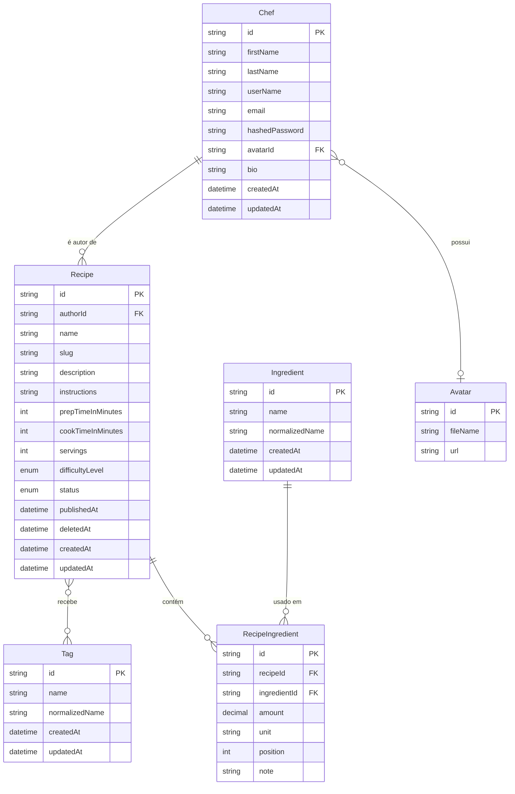

# Regras de Negócio — Cookbook

> **Objetivo do documento:** Estabelecer a especificação detalhada, estável e inequívoca das regras de negócio, invariantes de domínio e decisões de produto para o **Cookbook**, servindo como fonte única da verdade para engenharia e design de produto.
>
> **Relação com arquitetura técnica:** Este documento foca estritamente no **o quê** o produto deve fazer do ponto de vista do domínio de negócio. Para especificações sobre refatoração de código, padrões de persistência e decisões de infraestrutura, consulte o [Plano de Melhorias de Fundação](plans/completed/plano-melhorias-fundacao.md).

---

## 1. Visão Geral e Premissas do Produto

O **Cookbook** é um aplicativo social de livro de receitas no estilo TudoGostoso: usuários publicam receitas e descobrem receitas de outros usuários com filtros combinados (ingredientes, tempo, dificuldade, tags e outros critérios).

A evolução do produto segue duas fases funcionais:

| Fase | Foco | Sucesso |
|------|------|---------|
| **1 — Catálogo público pesquisável** | Conta, CRUD de receitas, publicação (rascunho → publicada), catálogo global de ingredientes/tags, busca global com filtros, perfis públicos | Usuários publicam receitas e encontram receitas de outros com filtros precisos |
| **2 — Interação entre usuários** | Favoritar, avaliar, seguir chefs, feed cronológico | Descoberta social leve sem perder a qualidade da busca |

**Modelo de publicação adotado:** toda receita nasce como **rascunho (`DRAFT`)** — visível apenas ao autor. O autor publica explicitamente (`PUBLISHED`), tornando a receita visível e pesquisável por qualquer pessoa, inclusive sem login. Rascunhos permitem salvar receitas incompletas; a validação estrita ocorre apenas na publicação.

---

## 2. Modelo de Domínio Atual (Visão Conceitual)

Representação conceitual das entidades de domínio identificadas no sistema:



### Vocabulário domínio ↔ persistência

| Domínio (TypeScript) | Prisma / banco | Observação |
|----------------------|----------------|------------|
| `Chef` | `User` / tabela `users` | Mapper traduz na fronteira |
| `prepTimeInMinutes` | `prepTime` | Nullable no schema |
| `cookTimeInMinutes` | `cookTime` | Nullable no schema |
| `hashedPassword` | `password` | Nunca exposto na API |
| `DifficultyLevel` | `Easy` / `Medium` / `Hard` | Conversão em `enum-mappers.ts` |
| `RecipeIngredientList` | — | Coleção em memória (`WatchedList`); não é tabela |
| `RecipeDetails` | — | Read model para consulta enriquecida |
| `NormalizedName` | `normalized_name` | Value object; chave de dedup |
| `Slug` | `slug` | Value object; imutável após create |

### Capacidades atuais vs. lacunas de negócio

**Capacidades existentes:**

- Cadastro e autenticação de chef (JWT)
- Edição de perfil próprio
- Criação e edição de receita própria (tags e ingredientes medidos)
- Consulta de receita por ID (requer JWT hoje)
- `Recipe` como `AggregateRoot` com `RecipeIngredientList` e sync atômico no repositório
- `RecipeCatalogResolver`: find-or-create normalizado para `Tag` e `Ingredient`
- Mapeamento de erros de domínio → HTTP (MF-06)

**Lacunas identificadas:**

- Ausência de estados de publicação (`DRAFT` / `PUBLISHED`)
- Ausência de listagem e busca estruturada (global e por autor)
- Ausência de exclusão de receitas
- Ausência de paginação
- Ausência de perfil público por `userName`
- Leitura de receita publicada ainda exige autenticação
- Unidades de medida ainda são string livre
- Semântica de `null` em tempos/porções inconsistente entre domínio e schema

---

## 3. Sugestões e Análises Detalhadas por Tópico

Cada sugestão detalha o contexto do problema, a análise conceitual de produto/domínio e as regras de negócio formalizadas.

---

### Bloco A — Identidade e Autoria

#### Sugestão 1: Invariantes de Identidade do Chef

* **Contexto & Problema:** O modelo atual possui `@unique` no schema Prisma para `email` e `userName`, mas `RegisterChefUseCase` valida unicidade apenas de `email`. Em edição de perfil, não há verificação explícita de colisão de `userName`. O `userName` será usado como identificador público de rota (`/@userName`) na Fase 1.
* **Análise de Domínio:** A entidade `Chef` é o núcleo de identidade. Ambiguidades em `email` ou `userName` geram brechas de segurança, inconsistências de roteamento e conflitos de perfil público. O `avatarId` permanece opcional enquanto o serviço de mídia não estiver especificado.
* **Regras de Negócio Formalizadas:**
  1. **Unicidade de identificadores:** `email` e `userName` devem ser estritamente únicos em todo o sistema. A verificação ocorre na camada de domínio antes da persistência, com comparação *case-insensitive* para ambos.
  2. **Regra de alteração de perfil:** Ao editar o perfil, o chef pode manter seus valores atuais. Caso altere `email` ou `userName`, o sistema garante que o novo valor não pertence a outro chef.
  3. **Formatação de `userName`:** Aceita apenas caracteres alfanuméricos, hífens e underlines (`[a-zA-Z0-9_-]`), com tamanho entre 3 e 30 caracteres. Não são permitidos espaços ou caracteres especiais.
  4. **Nomes reservados:** O sistema rejeita `userName` que coincidam com rotas reservadas (ex.: `admin`, `api`, `recipes`, `search`, `accounts`, `sessions`).
  5. **Avatar opcional (stub na Fase 1):** O campo `avatarId` é opcional (`nullable`). O carregamento e deleção de arquivo ficam postergados até a especificação do serviço de mídia.

---

#### Sugestão 2: Autoria Imutável e Derivada da Sessão

* **Contexto & Problema:** Não há regra explícita de que `authorId` deve ser derivado exclusivamente do token JWT, nunca do payload da requisição. A transferência de autoria não está proibida formalmente.
* **Análise de Domínio:** Em um catálogo público, a autoria é atributo imutável da receita. Permitir que o cliente informe `authorId` abriria brecha para atribuição fraudulenta. Toda mutação deve verificar que o ator é o autor.
* **Regras de Negócio Formalizadas:**
  1. **Derivação de autoria:** Em `CreateRecipeUseCase`, `authorId` é sempre obtido de `@CurrentUser().sub` (JWT). O payload da requisição nunca aceita `authorId`.
  2. **Autoria imutável:** Após a criação, `authorId` não pode ser alterado por nenhuma operação.
  3. **Verificação em mutações:** Toda operação de edição ou exclusão confere `recipe.authorId === actorId`. Caso contrário, retorna `NotAllowedError` (HTTP 403).
  4. **Escopo de aplicação:** A regra vale para `EditRecipeUseCase`, `DeleteRecipeUseCase`, `PublishRecipeUseCase` e `UnpublishRecipeUseCase`.

---

### Bloco B — Ciclo de Vida da Receita

#### Sugestão 3: Estados de Publicação `DRAFT` / `PUBLISHED`

* **Contexto & Problema:** O modelo atual não possui campo de status de publicação. Toda receita criada é implicitamente legível por qualquer requisição autenticada, sem distinção entre rascunho e conteúdo pronto para compartilhamento.
* **Análise de Domínio:** Num app social de receitas, o autor precisa salvar trabalho em progresso sem expor conteúdo incompleto. A publicação é um ato explícito que torna a receita parte do catálogo público pesquisável.
* **Regras de Negócio Formalizadas:**
  1. **Campo de status:** Adicionar `status` na entidade `Recipe`, do tipo enum `RecipeStatus` com valores `DRAFT` e `PUBLISHED`.
  2. **Valor padrão:** Toda nova receita nasce com `status = DRAFT`.
  3. **Timestamp de publicação:** Ao transicionar para `PUBLISHED`, o sistema registra `publishedAt` (data/hora da primeira publicação; mantido em republicações após despublicar).
  4. **Controle de acesso de leitura:**
     - `DRAFT`: consultável, listável e editável **apenas pelo autor** autenticado.
     - `PUBLISHED`: consultável por **qualquer pessoa**, inclusive sem autenticação.
  5. **Transições permitidas:**
     - `DRAFT` → `PUBLISHED` (publicar): exige validação de conteúdo mínimo (Sugestão 4).
     - `PUBLISHED` → `DRAFT` (despublicar): permitido pelo autor a qualquer momento.
  6. **Rotas públicas:** `GET /recipes/:id` e `GET /recipes/:id-:slug` para receitas `PUBLISHED` não exigem JWT (`@Public()`).

---

#### Sugestão 4: Validação em Dois Níveis (Rascunho vs. Publicação)

* **Contexto & Problema:** Exigir todos os campos obrigatórios no momento do save impede o fluxo de "salvar rascunho e completar depois". Por outro lado, publicar receita incompleta prejudica a qualidade do catálogo público.
* **Análise de Domínio:** O modelo rascunho → publicada separa **persistência tolerante** (salvar progresso) de **validação estrita** (entrar no catálogo). A invariante de conteúdo mínimo aplica-se apenas na transição para `PUBLISHED`.
* **Regras de Negócio Formalizadas:**
  1. **Rascunho tolerante:** Receitas em `DRAFT` podem ser salvas com campos incompletos (nome vazio, zero ingredientes, instruções vazias).
  2. **Requisitos para publicar:** Ao transicionar para `PUBLISHED`, a receita deve possuir:
     - `name` não-vazio
     - `instructions` não-vazio
     - **Pelo menos 1 (um)** `RecipeIngredient` na lista
  3. **Erro de domínio dedicado:** Se a validação falhar na publicação, o sistema lança `RecipeNotPublishableError` com mensagem descritiva dos campos faltantes. O rascunho permanece salvo.
  4. **Edição de publicada:** Alterações em receita `PUBLISHED` que violariam os requisitos mínimos (ex.: remover todos os ingredientes) são rejeitadas com `RecipeNotPublishableError`, não revertendo automaticamente para `DRAFT`.

---

#### Sugestão 5: Exclusão e Arquivamento (Soft Delete)

* **Contexto & Problema:** Não há especificação de exclusão de receitas. Hard delete de receitas publicadas quebraria links externos, favoritos (Fase 2) e histórico de descoberta.
* **Análise de Domínio:** Receitas publicadas geram URLs compartilháveis e serão referenciadas por outros usuários. Soft delete preserva integridade referencial e permite auditoria, enquanto remove o conteúdo da busca e listagens.
* **Regras de Negócio Formalizadas:**
  1. **Soft delete:** Exclusão de receita define `deletedAt` com timestamp atual. O registro permanece no banco, mas é excluído de buscas, listagens e leitura pública.
  2. **Autorização:** Apenas o autor (`authorId === actorId`) pode excluir sua receita.
  3. **Leitura pós-exclusão:** Receitas com `deletedAt` não-nulo retornam `ResourceNotFoundError` (HTTP 404) para qualquer requisição, inclusive do autor.
  4. **Preservação de catálogos globais:** A exclusão de uma receita **nunca** apaga registros das tabelas globais `Ingredient` e `Tag`.
  5. **Hard delete:** Não adotado na Fase 1. Reavaliar apenas por requisito legal (LGPD) ou política de retenção.

---

#### Sugestão 6: Slug Estável e URL Canônica

* **Contexto & Problema:** O `slug` é gerado na criação, mas não havia definição formal sobre imutabilidade, unicidade e estrutura de URL pública.
* **Análise de Domínio:** O comportamento atual do código já mantém o slug imutável após rename (confirmado em e2e). A URL canônica `{id}-{slug}` usa o `id` como chave de roteamento e o `slug` apenas para legibilidade e SEO.
* **Regras de Negócio Formalizadas:**
  1. **Geração inicial:** O `slug` é gerado automaticamente na criação a partir do `name` (minúsculas, sem acentos, espaços → hífens). Ex.: `"Bolo de Cenoura"` → `"bolo-de-cenoura"`.
  2. **Imutabilidade:** Após a criação, o `slug` permanece estável mesmo que o `name` seja alterado.
  3. **Unicidade:** O `slug` **não** precisa ser único globalmente, pois a rota primária é `/{id}-{slug}`.
  4. **Resolução de rota:** O roteamento utiliza o `id`. Se o `id` estiver correto, a receita é entregue independentemente do `slug` na URL (resiliência a links antigos).
  5. **Estrutura canônica:** URLs públicas seguem `/{id}-{slug}` (ex.: `/clx123456-bolo-de-cenoura`).

---

### Bloco C — Conteúdo da Receita

#### Sugestão 7: Semântica de `null` em Tempos e Porções

* **Contexto & Problema:** O domínio (`Recipe.create`) atribui defaults `prepTimeInMinutes=0`, `cookTimeInMinutes=0`, `servings=1` quando omitidos, enquanto o schema Prisma aceita `null`. Valor `0` para tempo sugere refeição instantânea e distorce filtros de busca.
* **Análise de Domínio:** Diferenciar "não informado" de "ausência real de etapa" é essencial para filtros confiáveis. Uma salada com `cookTimeInMinutes=0` é informação válida; tempo omitido não deve aparecer em "receitas em menos de 15 minutos".
* **Regras de Negócio Formalizadas:**
  1. **Valores opcionais via nullability:** `prepTimeInMinutes`, `cookTimeInMinutes` e `servings` aceitam `null`.
  2. **Diferenciação semântica:**
     - `null` = informação não declarada pelo autor.
     - `0` = ausência real de etapa (ex.: `cookTimeInMinutes=0` para prato cru).
  3. **Validação:** Quando informados, tempos devem ser inteiros `>= 0`. `servings`, se informado, deve ser `>= 1`.
  4. **Impacto em filtros:** Filtro por tempo total (`prepTimeInMinutes + cookTimeInMinutes`) ignora registros onde ambos os tempos são `null`, salvo parâmetro explícito `includeUnspecifiedTime=true`.

---

#### Sugestão 8: Vocabulário Controlado de Unidades de Medida

* **Contexto & Problema:** O campo `unit` em `RecipeIngredient` é string livre, permitindo inconsistências (`"g"`, `"gramas"`, `"colher"`, `"colheres de sopa"`). O domínio já possui comentário `// TODO fazer enum de unit`.
* **Análise de Domínio:** Texto livre inviabiliza agregação futura, conversão automatizada e padronização visual. Um enum fechado com tradução no frontend resolve o problema sem perder flexibilidade de apresentação.
* **Regras de Negócio Formalizadas:**
  1. **Enum `MeasurementUnit`:** O campo `unit` restringe-se ao conjunto padronizado abaixo.
  2. **Valores permitidos:**
     - **Massa/peso:** `GRAM` (`g`), `KILOGRAM` (`kg`)
     - **Volume:** `MILLILITER` (`ml`), `LITER` (`l`)
     - **Medidas caseiras:** `CUP` (`xícara`), `TABLESPOON` (`colher de sopa`), `TEASPOON` (`colher de chá`), `PINCH` (`pitada`)
     - **Unidades discretas:** `UNIT` (`unidade`), `CLOVE` (`dente`), `SLICE` (`fatia`), `CAN` (`lata`), `PACKAGE` (`pacote`)
     - **A gosto:** `TO_TASTE` (`a gosto`)
  3. **`amount` e `TO_TASTE`:** Quando `unit = TO_TASTE`, `amount` deve ser `null`.
  4. **Apresentação:** O backend armazena o enum codificado; o frontend traduz e pluraliza conforme `amount` (ex.: `1 colher de sopa` vs `2 colheres de sopa`).

---

#### Sugestão 9: `RecipeIngredient` como Entidade do Agregado, com Ordem e Observação

* **Contexto & Problema:** `RecipeIngredient` já é entidade filha do agregado `Recipe` (MF-02), com substituição de conjunto na edição (MF-09). Porém, a ordem dos ingredientes na lista e observações por linha (`"para polvilhar"`) não são modeladas, e a igualdade atual (`ingredientId + amount + unit`) impede o mesmo ingrediente em duas linhas legítimas.
* **Análise de Domínio:** A ordem dos ingredientes é informação de receita (lista de compras, modo de preparo). Observações por linha são comuns na culinária. `position` desambigua linhas com o mesmo ingrediente.
* **Regras de Negócio Formalizadas:**
  1. **Agregado restrito:** `RecipeIngredient` é controlado exclusivamente pela raiz `Recipe`. Nenhuma operação externa modifica linhas diretamente.
  2. **Campos adicionais:** Cada linha possui `position` (inteiro, ordem na lista, começando em 0) e `note` (string opcional, ex.: `"picado fino"`, `"para polvilhar"`).
  3. **Semântica de atualização (MF-09):** O payload de edição representa o estado desejado completo da lista:
     - Linhas com ID existente são atualizadas.
     - Linhas sem ID são criadas (find-or-create do `Ingredient` global por `normalizedName`).
     - Linhas omitidas no payload são removidas da receita.
  4. **Igualdade para diff:** Dois itens são considerados o mesmo se compartilham `id` (em edição) ou, na criação, `ingredientId + position`.

---

#### Sugestão 10: Instruções em Texto Livre na Fase 1

* **Contexto & Problema:** Não há decisão formal sobre o formato de `instructions`. Steps estruturados (array de passos) competem com simplicidade de cadastro. O Zod de `POST /recipes` exige `description`, enquanto o domínio a trata como opcional.
* **Análise de Domínio:** Na Fase 1, texto livre com quebras de linha atende busca e exibição. Steps estruturados só se justificam se a UX de busca ou exibição passo a passo exigir. `description` é resumo opcional; `instructions` é obrigatório apenas na publicação.
* **Regras de Negócio Formalizadas:**
  1. **Formato:** `instructions` permanece string de texto livre na Fase 1. Não criar entidade `RecipeStep` nem agregado separado.
  2. **Normalização:** O sistema normaliza quebras de linha (`\r\n` → `\n`) e aplica limite de tamanho (ex.: 10.000 caracteres).
  3. **`description` opcional:** Campo de resumo/introdução; pode ser omitido no create e edit.
  4. **Obrigatoriedade na publicação:** `instructions` não-vazio é requisito para transição `DRAFT` → `PUBLISHED` (Sugestão 4).

---

#### Sugestão 11: Tags — Opcionais, N:N, sem Entidade `Category`

* **Contexto & Problema:** Discussão sobre criar entidade `Category` com taxonomia rígida. Em catálogo público, tags livres podem gerar poluição (grafias inconsistentes, tags ofensivas, explosão de sinônimos).
* **Análise de Domínio:** Tags cumprem classificação flexível sem forçar escolha em eixos ortogonais (ocasião vs tipo de prato vs restrição). Categoria fixa exige migração e UI rígida. No entanto, catálogo público exige limites e curadoria mínima do vocabulário global.
* **Regras de Negócio Formalizadas:**
  1. **Sem `Category`:** Classificação exclusivamente via `Tag` (N:N flexível). Não criar entidade `Category` na Fase 1.
  2. **Tags opcionais:** Uma receita pode ter zero ou mais tags. Tags não são obrigatórias.
  3. **Tags canônicas sugeridas:** O frontend oferece chips de sugestão (ex.: `cafe-da-manha`, `almoco`, `jantar`, `massa`, `sopa`, `sobremesa`, `rapida`, `vegetariana`) + campo livre.
  4. **Dedup por nome normalizado:** `"Café da Manhã"` e `"cafe da manha"` apontam para a mesma `Tag` (`normalizedName = "cafe-da-manha"`).
  5. **Limites:** Máximo de 10 tags por receita; cada tag com até 50 caracteres; rejeitar tags vazias ou só espaços.
  6. **Curadoria do `name` de exibição:** O `name` global da tag é definido pelo primeiro cadastro. Alterações futuras de grafia exigem mecanismo de alias (fora de escopo Fase 1).
  7. **Semântica de edição (MF-09):** Enviar lista de tags na edição substitui o conjunto. Omitir o campo mantém as tags atuais.
  8. **Reavaliação de `Category`:** Só introduzir categoria fixa se a UX exigir navegação com **uma** dimensão obrigatória e exclusiva. Alternativa intermediária: no máximo um enum opcional em `Recipe` (ex.: `mealOccasion`), não taxonomia paralela completa.

---

### Bloco D — Descoberta (Coração do Produto)

#### Sugestão 12: Motor de Busca Global

* **Contexto & Problema:** O produto permite recuperar receitas apenas por ID. Falta a especificação da capacidade central: busca com filtros combinados sobre o catálogo público.
* **Análise de Domínio:** O diferencial do Cookbook é encontrar rapidamente o que cozinhar com base em ingredientes disponíveis, tempo livre ou preferências. A busca global sobre receitas `PUBLISHED` é o núcleo da Fase 1.
* **Regras de Negócio Formalizadas:**
  1. **Escopos de consulta:**
     - **Padrão (global):** Retorna receitas `PUBLISHED` e não excluídas de todos os chefs.
     - **`mine`:** Retorna receitas do chef autenticado, incluindo `DRAFT` e `PUBLISHED` (exige JWT).
  2. **Filtros suportados (combináveis via AND lógico):**
     - **`query`:** Busca parcial case-insensitive em `name` e `description`.
     - **`ingredients[]`:** IDs ou nomes normalizados. Modo `ingredientMatch=ALL` (padrão) ou `ANY`.
     - **`excludeIngredients[]`:** Exclui receitas que contenham qualquer um dos ingredientes informados (restrições/alergias).
     - **`tags[]`:** IDs ou nomes normalizados. Modo `tagMatch=ALL` ou `ANY` (padrão: `ANY`).
     - **`difficultyLevel`:** Filtro por enum (`EASY`, `MEDIUM`, `HARD`).
     - **`maxTotalTimeInMinutes`:** `prepTimeInMinutes + cookTimeInMinutes <= valor`. Ignora registros com ambos os tempos `null`.
     - **`authorUserName`:** Filtra por autor específico (apenas receitas `PUBLISHED` desse autor).
  3. **Ordenação:** Padrão `createdAt DESC`. Alternativas: `totalTime ASC`, `name ASC`. Desempate estável por `id`.
  4. **Exclusão implícita:** Receitas com `deletedAt` não-nulo ou `status = DRAFT` (no escopo global) nunca aparecem nos resultados.

---

#### Sugestão 13: Paginação Obrigatória

* **Contexto & Problema:** Nenhum dos documentos anteriores especificou paginação. `PaginationParams` existe em `src/core/repositories/pagination-params.ts` mas nunca foi utilizado. Listagens sem paginação não escalam.
* **Análise de Domínio:** Busca global, listagem por autor e feed (Fase 2) retornam conjuntos potencialmente grandes. Paginação é requisito de contrato de API, não detalhe de implementação.
* **Regras de Negócio Formalizadas:**
  1. **Parâmetros:** `page` (inteiro, padrão 1, mínimo 1) e `perPage` (inteiro, padrão 20, máximo 50).
  2. **Contrato de resposta:**
     ```json
     {
       "items": [...],
       "meta": {
         "page": 1,
         "perPage": 20,
         "totalItems": 142,
         "totalPages": 8
       }
     }
     ```
  3. **Escopo:** Paginação obrigatória em busca global, listagem por autor, listagem de rascunhos (`mine`) e feed (Fase 2).
  4. **Port de repositório:** `RecipesRepository` ganha `findMany(params: SearchRecipesParams): Promise<PaginatedResult<RecipeSummary>>`.

---

#### Sugestão 14: Busca "O Que Eu Posso Cozinhar" (Modo Despensa)

* **Contexto & Problema:** Usuários frequentemente querem saber quais receitas podem fazer com os ingredientes que têm em casa. Isso difere de busca por ingrediente específico — é ranqueamento por cobertura.
* **Análise de Domínio:** Modo despensa é variante do motor de busca: dado um conjunto de ingredientes disponíveis, ranquear receitas `PUBLISHED` por percentual de cobertura e expor quantos ingredientes faltam. **Não** cria estoque ou despensa persistida na Fase 1 — é parâmetro de consulta, não entidade.
* **Regras de Negócio Formalizadas:**
  1. **Parâmetro:** `pantryIngredients[]` — lista de IDs ou nomes normalizados de ingredientes disponíveis.
  2. **Ranqueamento:** Ordenar por `coveragePercent DESC` (ingredientes da receita presentes na despensa / total de ingredientes da receita).
  3. **Metadado por resultado:** Cada item inclui `missingIngredients[]` (ingredientes da receita ausentes na despensa) e `coveragePercent`.
  4. **Filtro opcional:** `minCoveragePercent` (ex.: 80) para exibir apenas receitas quase completas.
  5. **Não-escopo:** Não persistir despensa do usuário na Fase 1. Não criar entidade `Pantry` ou `PantryItem`.

---

#### Sugestão 15: Perfil Público e Listagem por Autor

* **Contexto & Problema:** Não há endpoint ou regra para visualizar o perfil de um chef e suas receitas publicadas. O `userName` será rota pública.
* **Análise de Domínio:** Perfil público é pré-requisito para descoberta social e compartilhamento. Deve expor apenas informações públicas e receitas `PUBLISHED`, nunca rascunhos.
* **Regras de Negócio Formalizadas:**
  1. **Rota:** `GET /@:userName` (ou `GET /chefs/:userName`) retorna perfil público: `userName`, `firstName`, `lastName`, `bio`, `avatarId` (se houver).
  2. **Listagem de receitas do autor:** `GET /chefs/:userName/recipes` retorna receitas `PUBLISHED` e não excluídas, paginadas, ordenadas por `createdAt DESC`.
  3. **Acesso sem login:** Perfil e listagem são públicos (`@Public()`).
  4. **Rascunhos:** Nunca aparecem em perfil público, mesmo para o próprio autor (usar escopo `mine` na busca).
  5. **Chef inexistente:** Retorna `ResourceNotFoundError` (HTTP 404).

---

### Bloco E — Integridade do Catálogo Global

#### Sugestão 16: Catálogo Global de `Ingredient` e `Tag`

* **Contexto & Problema:** `Ingredient` e `Tag` são catálogos globais compartilhados entre receitas e chefs. Find-or-create já funciona via `RecipeCatalogResolver`, mas faltam regras de integridade e anti-poluição para catálogo público.
* **Análise de Domínio:** `normalizedName` é a chave canônica de dedup e filtro. O catálogo acumula vocabulário do sistema e sobrevive à exclusão de receitas. Em escala, sinônimos e plurais exigirão mecanismo de alias (futuro).
* **Regras de Negócio Formalizadas:**
  1. **Chave canônica:** `normalizedName` (gerado via `NormalizedName.createFromText`) é único por entidade e usado em find-or-create e filtros de busca.
  2. **Find-or-create:** Ao associar tag ou ingrediente a uma receita, o sistema busca por `normalizedName`; se não existir, cria com `name` informado pelo usuário.
  3. **Sobrevivência:** Exclusão de receita não remove `Ingredient` nem `Tag` do catálogo global.
  4. **Anti-poluição:**
     - Rejeitar nomes vazios ou só espaços.
     - Limite de 100 caracteres para `name`.
     - Normalização impede duplicatas por caixa/acentos, mas não por sinônimos (`"tomate"` vs `"tomates"` permanecem distintos na Fase 1).
  5. **Alias futuro:** Mecanismo de sinônimos/plurais (`IngredientAlias`) fica fora de escopo da Fase 1; documentar como evolução planejada.

---

### Bloco F — Escopo

#### Sugestão 17: Fase 2 e Não-Escopo Explícito

* **Contexto & Problema:** Risco de contaminação do escopo da Fase 1 com funcionalidades sociais prematuras ou features que competem com o motor de busca. Decisões negativas ("não fazer X") se perdem facilmente se não forem documentadas.
* **Análise de Domínio:** A Fase 1 deve entregar catálogo público pesquisável com qualidade. A Fase 2 adiciona interação social leve, na ordem correta de dependências, sem comprometer a busca.
* **Regras de Negócio Formalizadas:**

  **Fase 2 — o que SERÁ incluído (nesta ordem):**
  1. **Publicação e visibilidade** (Sugestões 3–4) — pré-requisito de tudo.
  2. **Favoritar / guardar receita:** Nova relação `ChefFavoriteRecipe` (`chefId`, `recipeId`, `createdAt`). Chef salva receita pública de outro sem alterar autoria.
  3. **Avaliação simples:** Nota ou curtida em receita pública (sem comentários na etapa inicial).
  4. **Seguir chef:** Relação `ChefFollowsChef` (`followerId`, `followingId`).
  5. **Feed cronológico:** Receitas públicas recentes dos chefs seguidos.

  **Fora de escopo (Fase 1 e Fase 2 inicial):**
  - Entidade `Category` ou taxonomia rígida paralela a tags
  - Steps/ingredientes como agregados separados de `Recipe`
  - Tags obrigatórias
  - Estoque de despensa persistido (`Pantry` / `PantryItem`)
  - Campos sociais em `Chef` (followers count, stats, badges)
  - Meal plan / planejamento de refeições
  - Remix / fork de receitas
  - Cálculo de nutrição ou calorias
  - Moderação de conteúdo pesada ou fluxos complexos de denúncia
  - Comentários em receitas (adiar para após avaliação simples)
  - Algoritmo de feed por engajamento (feed é cronológico)

---

## 4. Tabela Resumida de Decisões do Domínio

| Entidade / Recurso | Decisão de Produto | Justificativa de Negócio |
| :--- | :--- | :--- |
| **Chef** | Manter estrutura; validar `userName` e `email` únicos no domínio; formato e nomes reservados | Identidade sólida para perfil público e roteamento |
| **Chef.avatarId** | Opcional (stub Fase 1) | Storage de mídia ainda não especificado |
| **Recipe.status** | Enum `DRAFT` (default) / `PUBLISHED` + `publishedAt` | Rascunho tolerante; publicação explícita para catálogo |
| **Recipe.deletedAt** | Soft delete | Preserva links, favoritos e integridade referencial |
| **Recipe.times/servings** | `null` = não informado; `0` = ausência real | Evita dados falsos e falhas em filtros de tempo |
| **Recipe.slug** | Gerado no create, imutável; URL `/{id}-{slug}` | Previne link rot; `id` é chave de roteamento |
| **Recipe.instructions** | Texto livre Fase 1; obrigatório na publicação | Simplicidade de cadastro; steps estruturados só se UX pedir |
| **Recipe.description** | Opcional | Resumo/introdução; não bloqueia rascunho |
| **Recipe.ingredients** | Mínimo 1 para publicar; `position` + `note` por linha | Receita sem ingrediente é inválida no catálogo público |
| **RecipeIngredient.unit** | Enum `MeasurementUnit` | Padronização, agregação e conversão futura |
| **Tag** | Opcionais; máx. 10 por receita; sem `Category` | Flexibilidade sem rigidez taxonômica |
| **Ingredient / Tag** | Catálogo global; `normalizedName` como chave; find-or-create | Dedup, filtros e vocabulário compartilhado |
| **Busca** | Global sobre `PUBLISHED`; filtros combinados; paginação | Diferencial central da Fase 1 |
| **Modo despensa** | Parâmetro de consulta; não persistido | Ranqueamento por cobertura sem complexidade de estoque |
| **Perfil público** | `/@userName` + receitas publicadas paginadas | Descoberta e compartilhamento |

---

## 5. Inconsistências do Código vs. Regras (Backlog)

| Área | Estado atual | Regra desejada | Plano sugerido |
| :--- | :--- | :--- | :--- |
| `Recipe.create` defaults | `prepTime=0`, `cookTime=0`, `servings=1` | `null` quando omitido | Ajustar factory + use case |
| `RecipeIngredient.amount/unit` | Obrigatórios no domínio; nullable no Prisma | Alinhar; `amount` nullable com `TO_TASTE` | Migration + entidade |
| `GET /recipes/:id` | Exige JWT | Público para `PUBLISHED` | `@Public()` + checagem de status |
| `POST /recipes` Zod | `description` obrigatório | Opcional | Ajustar schema |
| `CreateRecipeUseCase` | `Either<null, …>` sem erros | Suportar `RecipeNotPublishableError` | Refatorar após status |
| `Recipe.status` | Não existe | `DRAFT` / `PUBLISHED` | Migration + entidade + use cases |
| `Recipe.deletedAt` | Não existe | Soft delete | Migration + `DeleteRecipeUseCase` |
| `RecipeIngredient.position/note` | Não existem | Ordem e observação por linha | Migration + entidade |
| `unit` | `string` livre | Enum `MeasurementUnit` | Domínio + Prisma enum |
| `PaginationParams` | Existe, não usado | Usar em busca e listagens | Novo port + use case |
| Busca/listagem | Não existe | `SearchRecipesUseCase` | Novo MF ou plano derivado |
| Perfil público | Não existe | `GetChefProfileUseCase` | Novo MF ou plano derivado |
| Autoria de receita | `EditRecipe` usava `authorId` como ator; Prisma `save` reescrevia `authorId` | `actorId` na edição; `authorId` omitido no update | **MF-18** ✅ |

---

## 6. Veredito e Próximos Passos

O modelo conceitual do **Cookbook** possui base sólida após a fundação MF-01…MF-10: agregado de receita, sync atômico, normalização de catálogo, autorização de mutações e mapeamento de erros. A principal evolução é transicionar de um CRUD básico para um **catálogo público pesquisável** com ciclo de vida de publicação.

**Sequência sugerida de planos derivados:**

| Ordem | Plano | Escopo principal |
| :---: | :--- | :--- |
| 0 | **MF-18 — Autoria imutável** ✅ | `actorId` em edit; `authorId` do JWT no create; omit no Prisma `save` |
| 1 | **MF-11 — Publicação e status** | `RecipeStatus`, `publishedAt`, `PublishRecipeUseCase`, leitura pública |
| 2 | **MF-12 — Invariantes de Chef** ✅ | Unicidade de `userName`, formato, nomes reservados |
| 3 | **MF-13 — Semântica de null e unidades** | Defaults corrigidos, enum `MeasurementUnit`, `position`/`note` |
| 4 | **MF-14 — Busca e paginação** | `SearchRecipesUseCase`, filtros combinados, `PaginationParams` |
| 5 | **MF-15 — Perfil público** | `GetChefProfileUseCase`, listagem por autor |
| 6 | **MF-16 — Exclusão (soft delete)** | `DeleteRecipeUseCase`, `deletedAt` |
| 7 | **MF-17 — Modo despensa** | Ranqueamento por cobertura de ingredientes |

Cada plano deve seguir o [template do guia de fundação](plans/completed/plano-melhorias-fundacao.md#template-para-planos-derivados): critério de pronto (unit para regras, e2e para wiring), sem duplicar branches de use case em e2e.
