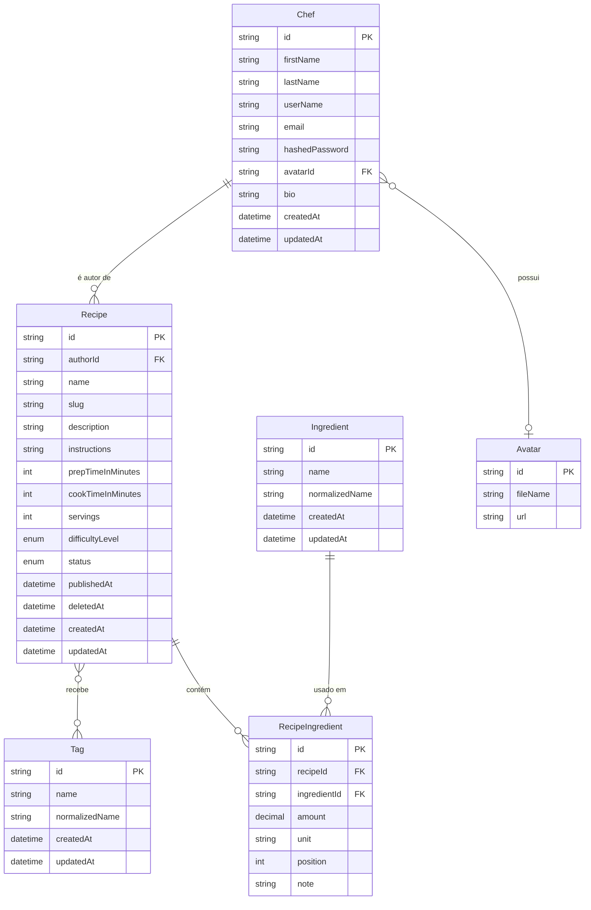

# Regras de Negócio — Cookbook

> **Objetivo do documento:** Estabelecer a especificação detalhada, estável e inequívoca das regras de negócio, invariantes de domínio e decisões de produto para o **Cookbook**, servindo como fonte única da verdade para engenharia e design de produto.
>
> **Relação com arquitetura técnica:** Este documento foca estritamente no **o quê** o produto deve fazer do ponto de vista do domínio de negócio. Para especificações sobre refatoração de código, padrões de persistência e decisões de infraestrutura, consulte o [Plano de Melhorias de Fundação](plans/completed/plano-melhorias-fundacao.md).

---

## 1. Visão Geral e Premissas do Produto

O **Cookbook** é um aplicativo social de livro de receitas no estilo TudoGostoso: usuários publicam receitas e descobrem receitas de outros usuários com filtros combinados (ingredientes, tempo, dificuldade, tags e outros critérios).

A evolução do produto segue duas fases funcionais:

| Fase | Foco | Sucesso |
|------|------|---------|
| **1 — Catálogo público pesquisável** | Conta, CRUD de receitas, publicação (rascunho → publicada), catálogo global de ingredientes/tags, busca global com filtros, perfis públicos | Usuários publicam receitas e encontram receitas de outros com filtros precisos |
| **2 — Interação entre usuários** | Favoritar, avaliar, seguir chefs, feed cronológico | Descoberta social leve sem perder a qualidade da busca |

**Modelo de publicação adotado:** toda receita nasce como **rascunho (`DRAFT`)** — visível apenas ao autor. O autor publica explicitamente (`PUBLISHED`), tornando a receita visível e pesquisável por qualquer pessoa, inclusive sem login. Rascunhos permitem salvar receitas incompletas; a validação estrita ocorre apenas na publicação.

---

## 2. Modelo de Domínio Atual (Visão Conceitual)

Representação conceitual das entidades de domínio identificadas no sistema:



### Vocabulário domínio ↔ persistência

| Domínio (TypeScript) | Prisma / banco | Observação |
|----------------------|----------------|------------|
| `Chef` | `User` / tabela `users` | Mapper traduz na fronteira |
| `prepTimeInMinutes` | `prepTime` | Nullable no schema |
| `cookTimeInMinutes` | `cookTime` | Nullable no schema |
| `hashedPassword` | `password` | Nunca exposto na API |
| `DifficultyLevel` | `Easy` / `Medium` / `Hard` | Conversão em `enum-mappers.ts` |
| `RecipeIngredientList` | — | Coleção em memória (`WatchedList`); não é tabela |
| `RecipeDetails` | — | Read model para consulta enriquecida |
| `NormalizedName` | `normalized_name` | Value object; chave de dedup |
| `Slug` | `slug` | Value object; imutável após create |

### Capacidades atuais vs. lacunas de negócio

**Capacidades existentes:**

- Cadastro e autenticação de chef (JWT)
- Edição de perfil próprio
- Criação e edição de receita própria (tags e ingredientes medidos)
- Consulta de receita por ID (pública para `PUBLISHED`; rascunho só autor)
- Estados de publicação (`DRAFT` / `PUBLISHED`) com `PublishRecipeUseCase` e `UnpublishRecipeUseCase`
- `Recipe` como `AggregateRoot` com `RecipeIngredientList` e sync atômico no repositório
- `RecipeCatalogResolver`: find-or-create normalizado para `Tag` e `Ingredient`
- Mapeamento de erros de domínio → HTTP (MF-06)

**Lacunas identificadas:**

- Ausência de listagem e busca estruturada (global e por autor)
- Ausência de exclusão de receitas
- Ausência de paginação
- Ausência de perfil público por `userName`
- Unidades de medida ainda são string livre

---

## 3. Sugestões e Análises Detalhadas por Tópico

Cada sugestão detalha o contexto do problema, a análise conceitual de produto/domínio e as regras de negócio formalizadas.

---

### Bloco A — Identidade e Autoria

#### Sugestão 1: Invariantes de Identidade do Chef

* **Contexto & Problema:** O modelo atual possui `@unique` no schema Prisma para `email` e `userName`, mas `RegisterChefUseCase` valida unicidade apenas de `email`. Em edição de perfil, não há verificação explícita de colisão de `userName`. O `userName` será usado como identificador público de rota (`/@userName`) na Fase 1.
* **Análise de Domínio:** A entidade `Chef` é o núcleo de identidade. Ambiguidades em `email` ou `userName` geram brechas de segurança, inconsistências de roteamento e conflitos de perfil público. O `avatarId` permanece opcional enquanto o serviço de mídia não estiver especificado.
* **Regras de Negócio Formalizadas:**
  1. **Unicidade de identificadores:** `email` e `userName` devem ser estritamente únicos em todo o sistema. A verificação ocorre na camada de domínio antes da persistência, com comparação *case-insensitive* para ambos.
  2. **Regra de alteração de perfil:** Ao editar o perfil, o chef pode manter seus valores atuais. Caso altere `email` ou `userName`, o sistema garante que o novo valor não pertence a outro chef.
  3. **Formatação de `userName`:** Aceita apenas caracteres alfanuméricos, hífens e underlines (`[a-zA-Z0-9_-]`), com tamanho entre 3 e 30 caracteres. Não são permitidos espaços ou caracteres especiais.
  4. **Nomes reservados:** O sistema rejeita `userName` que coincidam com rotas reservadas (ex.: `admin`, `api`, `recipes`, `search`, `accounts`, `sessions`).
  5. **Avatar opcional (stub na Fase 1):** O campo `avatarId` é opcional (`nullable`). O carregamento e deleção de arquivo ficam postergados até a especificação do serviço de mídia.

---

#### Sugestão 2: Autoria Imutável e Derivada da Sessão

* **Contexto & Problema:** Não há regra explícita de que `authorId` deve ser derivado exclusivamente do token JWT, nunca do payload da requisição. A transferência de autoria não está proibida formalmente.
* **Análise de Domínio:** Em um catálogo público, a autoria é atributo imutável da receita. Permitir que o cliente informe `authorId` abriria brecha para atribuição fraudulenta. Toda mutação deve verificar que o ator é o autor.
* **Regras de Negócio Formalizadas:**
  1. **Derivação de autoria:** Em `CreateRecipeUseCase`, `authorId` é sempre obtido de `@CurrentUser().sub` (JWT). O payload da requisição nunca aceita `authorId`.
  2. **Autoria imutável:** Após a criação, `authorId` não pode ser alterado por nenhuma operação.
  3. **Verificação em mutações:** Toda operação de edição ou exclusão confere `recipe.authorId === actorId`. Caso contrário, retorna `NotAllowedError` (HTTP 403).
  4. **Escopo de aplicação:** A regra vale para `EditRecipeUseCase`, `DeleteRecipeUseCase`, `PublishRecipeUseCase` e `UnpublishRecipeUseCase`.

---

### Bloco B — Ciclo de Vida da Receita

#### Sugestão 3: Estados de Publicação `DRAFT` / `PUBLISHED`

* **Contexto & Problema:** O modelo atual não possui campo de status de publicação. Toda receita criada é implicitamente legível por qualquer requisição autenticada, sem distinção entre rascunho e conteúdo pronto para compartilhamento.
* **Análise de Domínio:** Num app social de receitas, o autor precisa salvar trabalho em progresso sem expor conteúdo incompleto. A publicação é um ato explícito que torna a receita parte do catálogo público pesquisável.
* **Regras de Negócio Formalizadas:**
  1. **Campo de status:** Adicionar `status` na entidade `Recipe`, do tipo enum `RecipeStatus` com valores `DRAFT` e `PUBLISHED`.
  2. **Valor padrão:** Toda nova receita nasce com `status = DRAFT`.
  3. **Timestamp de publicação:** Ao transicionar para `PUBLISHED`, o sistema registra `publishedAt` (data/hora da primeira publicação; mantido em republicações após despublicar).
  4. **Controle de acesso de leitura:**
     - `DRAFT`: consultável, listável e editável **apenas pelo autor** autenticado.
     - `PUBLISHED`: consultável por **qualquer pessoa**, inclusive sem autenticação.
  5. **Transições permitidas:**
     - `DRAFT` → `PUBLISHED` (publicar): exige validação de conteúdo mínimo (Sugestão 4).
     - `PUBLISHED` → `DRAFT` (despublicar): permitido pelo autor a qualquer momento.
  6. **Rotas públicas:** `GET /recipes/:id` e `GET /recipes/:id-:slug` para receitas `PUBLISHED` não exigem JWT (`@Public()`).

---

#### Sugestão 4: Validação em Dois Níveis (Rascunho vs. Publicação)

* **Contexto & Problema:** Exigir todos os campos obrigatórios no momento do save impede o fluxo de "salvar rascunho e completar depois". Por outro lado, publicar receita incompleta prejudica a qualidade do catálogo público.
* **Análise de Domínio:** O modelo rascunho → publicada separa **persistência tolerante** (salvar progresso) de **validação estrita** (entrar no catálogo). A invariante de conteúdo mínimo aplica-se apenas na transição para `PUBLISHED`.
* **Regras de Negócio Formalizadas:**
  1. **Rascunho tolerante:** Receitas em `DRAFT` podem ser salvas com campos incompletos (nome vazio, zero ingredientes, instruções vazias).
  2. **Requisitos para publicar:** Ao transicionar para `PUBLISHED`, a receita deve possuir:
     - `name` não-vazio
     - `instructions` não-vazio
     - **Pelo menos 1 (um)** `RecipeIngredient` na lista
  3. **Erro de domínio dedicado:** Se a validação falhar na publicação, o sistema lança `RecipeNotPublishableError` com mensagem descritiva dos campos faltantes. O rascunho permanece salvo.
  4. **Edição de publicada:** Alterações em receita `PUBLISHED` que violariam os requisitos mínimos (ex.: remover todos os ingredientes) são rejeitadas com `RecipeNotPublishableError`, não revertendo automaticamente para `DRAFT`.

---

#### Sugestão 5: Exclusão e Arquivamento (Soft Delete)

* **Contexto & Problema:** Não há especificação de exclusão de receitas. Hard delete de receitas publicadas quebraria links externos, favoritos (Fase 2) e histórico de descoberta.
* **Análise de Domínio:** Receitas publicadas geram URLs compartilháveis e serão referenciadas por outros usuários. Soft delete preserva integridade referencial e permite auditoria, enquanto remove o conteúdo da busca e listagens.
* **Regras de Negócio Formalizadas:**
  1. **Soft delete:** Exclusão de receita define `deletedAt` com timestamp atual. O registro permanece no banco, mas é excluído de buscas, listagens e leitura pública.
  2. **Autorização:** Apenas o autor (`authorId === actorId`) pode excluir sua receita.
  3. **Leitura pós-exclusão:** Receitas com `deletedAt` não-nulo retornam `ResourceNotFoundError` (HTTP 404) para qualquer requisição, inclusive do autor.
  4. **Preservação de catálogos globais:** A exclusão de uma receita **nunca** apaga registros das tabelas globais `Ingredient` e `Tag`.
  5. **Hard delete:** Não adotado na Fase 1. Reavaliar apenas por requisito legal (LGPD) ou política de retenção.

---

#### Sugestão 6: Slug Estável e URL Canônica

* **Contexto & Problema:** O `slug` é gerado na criação, mas não havia definição formal sobre imutabilidade, unicidade e estrutura de URL pública.
* **Análise de Domínio:** O comportamento atual do código já mantém o slug imutável após rename (confirmado em e2e). A URL canônica `{id}-{slug}` usa o `id` como chave de roteamento e o `slug` apenas para legibilidade e SEO.
* **Regras de Negócio Formalizadas:**
  1. **Geração inicial:** O `slug` é gerado automaticamente na criação a partir do `name` (minúsculas, sem acentos, espaços → hífens). Ex.: `"Bolo de Cenoura"` → `"bolo-de-cenoura"`.
  2. **Imutabilidade:** Após a criação, o `slug` permanece estável mesmo que o `name` seja alterado.
  3. **Unicidade:** O `slug` **não** precisa ser único globalmente, pois a rota primária é `/{id}-{slug}`.
  4. **Resolução de rota:** O roteamento utiliza o `id`. Se o `id` estiver correto, a receita é entregue independentemente do `slug` na URL (resiliência a links antigos).
  5. **Estrutura canônica:** URLs públicas seguem `/{id}-{slug}` (ex.: `/clx123456-bolo-de-cenoura`).

---

### Bloco C — Conteúdo da Receita

#### Sugestão 7: Semântica de `null` em Tempos e Porções

* **Contexto & Problema:** O domínio (`Recipe.create`) atribui defaults `prepTimeInMinutes=0`, `cookTimeInMinutes=0`, `servings=1` quando omitidos, enquanto o schema Prisma aceita `null`. Valor `0` para tempo sugere refeição instantânea e distorce filtros de busca.
* **Análise de Domínio:** Diferenciar "não informado" de "ausência real de etapa" é essencial para filtros confiáveis. Uma salada com `cookTimeInMinutes=0` é informação válida; tempo omitido não deve aparecer em "receitas em menos de 15 minutos".
* **Regras de Negócio Formalizadas:**
  1. **Valores opcionais via nullability:** `prepTimeInMinutes`, `cookTimeInMinutes` e `servings` aceitam `null`.
  2. **Diferenciação semântica:**
     - `null` = informação não declarada pelo autor.
     - `0` = ausência real de etapa (ex.: `cookTimeInMinutes=0` para prato cru).
  3. **Validação:** Quando informados, tempos devem ser inteiros `>= 0`. `servings`, se informado, deve ser `>= 1`.
  4. **Impacto em filtros:** Filtro por tempo total (`prepTimeInMinutes + cookTimeInMinutes`) ignora registros onde ambos os tempos são `null`, salvo parâmetro explícito `includeUnspecifiedTime=true`. Filtro por porções mínimas (`minServings`, Sugestão 12.l) ignora registros com `servings` `null`.

---

#### Sugestão 8: Vocabulário Controlado de Unidades de Medida

* **Contexto & Problema:** O campo `unit` em `RecipeIngredient` é string livre, permitindo inconsistências (`"g"`, `"gramas"`, `"colher"`, `"colheres de sopa"`). O domínio já possui comentário `// TODO fazer enum de unit`.
* **Análise de Domínio:** Texto livre inviabiliza agregação futura, conversão automatizada e padronização visual. Um enum fechado com tradução no frontend resolve o problema sem perder flexibilidade de apresentação.
* **Regras de Negócio Formalizadas:**
  1. **Enum `MeasurementUnit`:** O campo `unit` restringe-se ao conjunto padronizado abaixo.
  2. **Valores permitidos:**
     - **Massa/peso:** `GRAM` (`g`), `KILOGRAM` (`kg`)
     - **Volume:** `MILLILITER` (`ml`), `LITER` (`l`), `GLASS` (`copo`), `BOWL` (`tigela`)
     - **Medidas caseiras:** `CUP` (`xícara`), `TABLESPOON` (`colher de sopa`), `TEASPOON` (`colher de chá`), `PINCH` (`pitada`), `DASH` (`fio`), `DROP` (`gota`)
     - **Unidades discretas:** `UNIT` (`unidade`), `CLOVE` (`dente`), `SLICE` (`fatia`), `PIECE` (`pedaço`), `CAN` (`lata`), `PACKAGE` (`pacote`), `JAR` (`pote`), `BOTTLE` (`garrafa`), `BOX` (`caixa`), `SACHET` (`sachê`)
     - **Partes de vegetais:** `BUNCH` (`maço`), `SPRIG` (`raminho`), `HEAD` (`cabeça`), `STALK` (`talo`)
     - **A gosto:** `TO_TASTE` (`a gosto`)
  3. **`amount` e `TO_TASTE`:** Quando `unit = TO_TASTE`, `amount` deve ser `null`.
  4. **Apresentação:** O backend armazena o enum codificado (`gram`, `tablespoon`, …). Tradução e pluralização em português ficam em `src/infra/i18n/measurement-units/` (`MEASUREMENT_UNIT_LABELS_PT_BR`, `formatMeasurementUnitLabel`).

---

#### Sugestão 9: `RecipeIngredient` como Entidade do Agregado, com Ordem e Observação

* **Contexto & Problema:** `RecipeIngredient` já é entidade filha do agregado `Recipe` (MF-02), com substituição de conjunto na edição (MF-09). Porém, a ordem dos ingredientes na lista e observações por linha (`"para polvilhar"`) não são modeladas, e a igualdade atual (`ingredientId + amount + unit`) impede o mesmo ingrediente em duas linhas legítimas.
* **Análise de Domínio:** A ordem dos ingredientes é informação de receita (lista de compras, modo de preparo). Observações por linha são comuns na culinária. `position` desambigua linhas com o mesmo ingrediente.
* **Regras de Negócio Formalizadas:**
  1. **Agregado restrito:** `RecipeIngredient` é controlado exclusivamente pela raiz `Recipe`. Nenhuma operação externa modifica linhas diretamente.
  2. **Campos adicionais:** Cada linha possui `position` (inteiro, ordem na lista, começando em 0) e `note` (string opcional, ex.: `"picado fino"`, `"para polvilhar"`).
  3. **Semântica de atualização (MF-09):** O payload de edição representa o estado desejado completo da lista:
     - Linhas com ID existente são atualizadas.
     - Linhas sem ID são criadas (find-or-create do `Ingredient` global por `normalizedName`).
     - Linhas omitidas no payload são removidas da receita.
  4. **Igualdade para diff:** Dois itens são considerados o mesmo se compartilham `id` (em edição) ou, na criação, `ingredientId + position`.

---

#### Sugestão 10: Instruções em Texto Livre na Fase 1

* **Contexto & Problema:** Não há decisão formal sobre o formato de `instructions`. Steps estruturados (array de passos) competem com simplicidade de cadastro. O Zod de `POST /recipes` exige `description`, enquanto o domínio a trata como opcional.
* **Análise de Domínio:** Na Fase 1, texto livre com quebras de linha atende busca e exibição. Steps estruturados só se justificam se a UX de busca ou exibição passo a passo exigir. `description` é resumo opcional; `instructions` é obrigatório apenas na publicação.
* **Regras de Negócio Formalizadas:**
  1. **Formato:** `instructions` permanece string de texto livre na Fase 1. Não criar entidade `RecipeStep` nem agregado separado.
  2. **Normalização:** O sistema normaliza quebras de linha (`\r\n` → `\n`) e aplica limite de tamanho (ex.: 10.000 caracteres).
  3. **`description` opcional:** Campo de resumo/introdução; pode ser omitido no create e edit.
  4. **Obrigatoriedade na publicação:** `instructions` não-vazio é requisito para transição `DRAFT` → `PUBLISHED` (Sugestão 4).

---

#### Sugestão 11: Tags — Opcionais, N:N, sem Entidade `Category`

* **Contexto & Problema:** Discussão sobre criar entidade `Category` com taxonomia rígida. Em catálogo público, tags livres podem gerar poluição (grafias inconsistentes, tags ofensivas, explosão de sinônimos).
* **Análise de Domínio:** Tags cumprem classificação flexível sem forçar escolha em eixos ortogonais (ocasião vs tipo de prato vs restrição). Categoria fixa exige migração e UI rígida. No entanto, catálogo público exige limites e curadoria mínima do vocabulário global.
* **Regras de Negócio Formalizadas:**
  1. **Sem `Category`:** Classificação exclusivamente via `Tag` (N:N flexível). Não criar entidade `Category` na Fase 1.
  2. **Tags opcionais:** Uma receita pode ter zero ou mais tags. Tags não são obrigatórias.
  3. **Tags canônicas sugeridas:** O frontend oferece chips de sugestão (ex.: `cafe-da-manha`, `almoco`, `jantar`, `massa`, `sopa`, `sobremesa`, `rapida`, `vegetariana`) + campo livre.
  4. **Dedup por nome normalizado:** `"Café da Manhã"` e `"cafe da manha"` apontam para a mesma `Tag` (`normalizedName = "cafe-da-manha"`).
  5. **Limites:** Máximo de 10 tags por receita; cada tag com até 50 caracteres; rejeitar tags vazias ou só espaços.
  6. **Curadoria do `name` de exibição:** O `name` global da tag é definido pelo primeiro cadastro. Alterações futuras de grafia exigem mecanismo de alias (fora de escopo Fase 1).
  7. **Semântica de edição (MF-09):** Enviar lista de tags na edição substitui o conjunto. Omitir o campo mantém as tags atuais.
  8. **Reavaliação de `Category`:** Só introduzir categoria fixa se a UX exigir navegação com **uma** dimensão obrigatória e exclusiva. Alternativa intermediária: no máximo um enum opcional em `Recipe` (ex.: `mealOccasion`), não taxonomia paralela completa.

---

### Bloco D — Descoberta (Coração do Produto)

#### Sugestão 12: Motor de Busca Global

* **Contexto & Problema:** O produto permite recuperar receitas apenas por ID. Falta a especificação da capacidade central: busca com filtros combinados sobre o catálogo público.
* **Análise de Domínio:** O diferencial do Cookbook é encontrar rapidamente o que cozinhar com base em ingredientes disponíveis, tempo livre ou preferências. A busca global sobre receitas `PUBLISHED` é o núcleo da Fase 1. Por concentrar decisões heterogêneas (visibilidade, filtros textuais, filtros de catálogo, ordenação), o motor de busca é detalhado em sub-sugestões independentes: cada uma pode ser especificada, implementada e testada isoladamente, e todas compartilham o mesmo contrato de consulta (`SearchRecipesParams`) e a mesma paginação obrigatória (Sugestão 13). Os filtros de 12.c–12.l combinam-se por AND lógico (12.b), permitindo consultas como “tomilho e alecrim, fácil, em menos de 1 hora”. **Inclusão de ingredientes** (`ingredients[]`, 12.d) e **cobertura da despensa** (`pantryIngredients[]`, Sugestão 14) são jornadas distintas: a primeira exige que a receita *use* os ingredientes informados; a segunda ranqueia o que é possível *com o que o usuário já tem*, podendo exigir cobertura total ou parcial.

| Sub-sugestão | Tema | Parâmetros |
| :--- | :--- | :--- |
| **12.a** | Escopos de consulta e visibilidade | `scope` |
| **12.b** | Composição de filtros, contrato e read models | — |
| **12.c** | Busca textual livre | `query` |
| **12.d** | Filtro por ingredientes exigidos | `ingredients[]`, `ingredientMatch` |
| **12.e** | Filtro por ingredientes excluídos | `excludeIngredients[]` |
| **12.f** | Filtro por tags | `tags[]`, `tagMatch` |
| **12.g** | Filtro por dificuldade | `difficultyLevel` |
| **12.h** | Filtro por tempo total | `maxTotalTimeInMinutes`, `includeUnspecifiedTime` |
| **12.i** | Filtro por autor | `authorUserName` |
| **12.j** | Ordenação e desempate estável | `sortBy` |
| **12.k** | Exclusão implícita de resultados | — |
| **12.l** | Filtro por porções | `minServings` |

---

##### Sugestão 12.a: Escopos de Consulta e Visibilidade

* **Contexto & Problema:** A mesma capacidade de busca serve a dois públicos com visibilidades opostas: qualquer visitante navegando no catálogo público e o autor gerenciando o próprio trabalho, inclusive rascunhos. Sem um escopo explícito, a alternativa seria inferir visibilidade a partir da presença de JWT — comportamento implícito e propenso a vazar rascunhos.
* **Análise de Domínio:** Visibilidade é regra de domínio, não detalhe de transporte. Tornar o escopo um parâmetro nomeado deixa a intenção explícita no contrato e mantém uma única implementação de filtros para ambos os casos. O escopo `mine` é o único caminho de descoberta de rascunhos no produto (perfil público nunca os exibe — Sugestão 15).
* **Regras de Negócio Formalizadas:**
  1. **Escopo padrão (global):** Na ausência de `scope`, a busca retorna receitas `PUBLISHED` e não excluídas de todos os chefs.
  2. **Acesso anônimo ao escopo global:** O escopo global não exige autenticação (`@Public()`). Estar autenticado não altera os resultados do escopo global.
  3. **Escopo `mine`:** Retorna receitas cujo `authorId` é o do chef autenticado, incluindo `DRAFT` e `PUBLISHED`, e exige JWT.
  4. **`mine` sem autenticação:** Requisição com `scope=mine` sem token válido é rejeitada pelo guard de autenticação (HTTP 401), antes do use case.
  5. **Ator derivado da sessão:** O `actorId` usado no escopo `mine` vem sempre de `@CurrentUser().sub`; o payload nunca aceita `authorId` como parâmetro de escopo (Sugestão 2).

---

##### Sugestão 12.b: Composição de Filtros, Contrato e Read Models

* **Contexto & Problema:** Filtros especificados isoladamente não definem o que acontece quando o usuário combina vários — nem o que acontece quando nenhum é informado, ou quando um filtro é informado vazio. Também falta definir qual shape de dados cada listagem expõe: o card do catálogo (foto, título, excerpt, tags) difere de “minhas receitas” (status de rascunho) e de resultados de busca filtrada (tempos, dificuldade, metadados de despensa).
* **Análise de Domínio:** A busca é uma consulta declarativa: cada filtro estreita o conjunto de resultados. Composição por AND lógico é o modelo mental esperado pelo usuário ("massa, vegetariana, até 30 minutos"). O contrato único de parâmetros permite que o port de repositório seja honrado igualmente pelo Prisma e pelo in-memory (Liskov). Read models seguem o padrão do projeto de referência (`QuestionDetails` vs `CommentWithAuthor`): **um value object por contexto de exibição**, não um único payload genérico que antecipa todos os campos possíveis. O agregado `Recipe` e `RecipeDetails` (página da receita) permanecem separados das listas.
* **Regras de Negócio Formalizadas:**
  1. **Combinação por AND lógico:** Todos os filtros informados são aplicados simultaneamente; um resultado só é retornado se satisfizer todos eles. A semântica `ALL`/`ANY` (12.d, 12.f) vale **dentro** de um filtro, nunca entre filtros distintos. Ex.: `ingredients[]=tomilho&ingredients[]=alecrim` + `difficultyLevel=EASY` + `maxTotalTimeInMinutes=60` exige as três condições.
  2. **Busca sem filtros:** Requisição sem nenhum filtro é válida e retorna o catálogo do escopo vigente, ordenado e paginado (Sugestões 12.j e 13).
  3. **Filtros ausentes vs. vazios:** Parâmetro omitido significa "sem restrição". Lista informada vazia é tratada como omitida, não como "nenhum resultado".
  4. **Contrato único de entrada:** Todos os parâmetros de 12.a–12.l formam `SearchRecipesParams`, entrada única de `SearchRecipesUseCase` e do port `RecipesRepository.findMany` (Sugestão 13, regra 4).
  5. **Parâmetros inválidos:** Valores fora do contrato (enum desconhecido, `perPage` acima do máximo, número negativo) são rejeitados na validação de entrada (HTTP 400), sem chegar ao domínio.
  6. **Read models por contexto (não o agregado completo):** Listagens retornam value objects de consulta, nunca `Recipe` com todas as linhas de ingredientes. Detalhe de página continua em `RecipeDetails` (`GET /recipes/:id`).
     - **`RecipeCatalogCard`** — catálogo público e grid da tela de receitas (`scope=global` sem filtros de catálogo pesados): `recipeId`, `slug`, `name`, excerpt de `description` (truncado na apresentação ou campo derivado), `tags`; `coverImageId` / URL quando mídia de receita existir (fora de escopo Fase 1). **Não** inclui autor, tempos, dificuldade, status nem datas no card padrão.
     - **`RecipeAuthorWorkspaceItem`** — escopo `mine`: `recipeId`, `slug`, `name`, `status`, `tags` (opcional); excerpt opcional. Sem tempos/dificuldade no list item de gestão.
     - **`RecipeSearchResultItem`** — quando há filtros de catálogo (12.c–12.l) ou modo despensa (14): estende o card com campos que a UI de resultados precisa para mostrar o match (`prepTimeInMinutes`, `cookTimeInMinutes`, `difficultyLevel`, `author`; e em 14, `coveragePercent`, `missingIngredients[]`).
  7. **Implementação transitória:** MF-25 introduziu `RecipeSummary` como read model único até os filtros e read models finais; evoluir para os shapes acima sem alterar o port `findMany` (mappers/presenters por contexto).
  8. **Apresentação de ingredientes na página de detalhe:** Quantidade e unidade (`amount`, `unit`) com nome do ingrediente e `note` opcional são formatados na camada de presenter/i18n (ex.: `formatMeasurementAmount` + label pt-BR), não fazem parte dos read models de listagem nem dos filtros de busca (12.d considera apenas presença do ingrediente).

---

##### Sugestão 12.c: Busca Textual Livre (`query`)

* **Contexto & Problema:** O caminho de entrada mais comum na descoberta é digitar um termo ("bolo de cenoura"). Sem regra formal, ficam indefinidos os campos pesquisados, a sensibilidade a caixa e acentos e o tratamento de termos com espaços.
* **Análise de Domínio:** Na Fase 1, busca por substring em `name` e `description` atende ao caso de uso sem introduzir infraestrutura de full-text search. `instructions` fica fora para evitar ruído (uma receita que apenas menciona "chocolate" no preparo não é uma receita de chocolate). Busca semântica e ranqueamento por relevância são evoluções posteriores.
* **Regras de Negócio Formalizadas:**
  1. **Campos pesquisados:** `query` faz correspondência parcial (substring) em `name` e `description`, combinados por OR entre os dois campos.
  2. **Insensibilidade a caixa:** A comparação é *case-insensitive* (`"BOLO"` encontra `"Bolo de Cenoura"`).
  3. **Normalização do termo:** Espaços nas extremidades são removidos; `query` vazia ou só com espaços é tratada como omitida (12.b, regra 3).
  4. **Limite de tamanho:** `query` aceita no máximo 100 caracteres; acima disso a requisição é rejeitada na validação de entrada.
  5. **Escopo respeitado:** A busca textual nunca amplia visibilidade — atua apenas sobre o conjunto já restrito pelo escopo (12.a) e pelas exclusões implícitas (12.k).
  6. **Não-escopo na Fase 1:** Sem ranqueamento por relevância, sem correção ortográfica (*fuzzy*) e sem busca em `instructions` ou em nomes de ingredientes (para ingredientes, usar 12.d).

---

##### Sugestão 12.d: Filtro por Ingredientes Exigidos (`ingredients[]`)

* **Contexto & Problema:** "Tenho frango e batata, o que faço?" é a pergunta central do produto. Sem definir o modo de correspondência, não fica claro se o usuário quer receitas que usem **todos** os ingredientes informados ou **qualquer um** deles.
* **Análise de Domínio:** Ambas as intenções são legítimas e correspondem a jornadas diferentes: `ALL` é filtro preciso ("receitas que levam frango **e** batata"); `ANY` é exploração ampla. O padrão `ALL` é mais previsível para quem informa vários ingredientes. A cobertura parcial com ranqueamento é jornada distinta e vive na Sugestão 14 (modo despensa).
* **Regras de Negócio Formalizadas:**
  1. **Parâmetro:** `ingredients[]` aceita IDs de `Ingredient` ou nomes; nomes são resolvidos por `normalizedName` (Sugestão 16, regra 1).
  2. **Nome não cadastrado:** Nome que não corresponde a nenhum `Ingredient` do catálogo global **não** cria registro; no modo `ALL` o resultado é vazio, no modo `ANY` o termo é simplesmente ignorado.
  3. **Modo `ALL` (padrão):** A receita só é retornada se contiver **todos** os ingredientes informados.
  4. **Modo `ANY`:** A receita é retornada se contiver **pelo menos um** dos ingredientes informados.
  5. **Seleção do modo:** `ingredientMatch` aceita `ALL` ou `ANY`; omitido, assume `ALL`.
  6. **Dedup de entrada:** Ingredientes repetidos na lista (por ID ou por `normalizedName`) são deduplicados antes da consulta e não afetam o modo `ALL`.
  7. **Independente de quantidade:** O filtro considera apenas a presença do ingrediente na receita; `amount`, `unit`, `position` e `note` da linha não participam do critério.
  8. **Distinção da despensa (Sugestão 14):** `ingredients[]` **não** garante que a receita possa ser feita *somente* com esses ingredientes — apenas que ela os *contém*. Para “o que posso fazer com o que tenho sem comprar nada”, usar `pantryIngredients[]` com `minCoveragePercent=100` (ou equivalente). Para “receitas que usam tomilho e alecrim que eu quero aproveitar”, usar `ingredients[]` com `ingredientMatch=ALL`.

---

##### Sugestão 12.e: Filtro por Ingredientes Excluídos (`excludeIngredients[]`)

* **Contexto & Problema:** Restrições alimentares e alergias são requisito de descoberta tão relevante quanto a inclusão. Sem exclusão explícita, um usuário com intolerância precisa inspecionar manualmente cada resultado.
* **Análise de Domínio:** Exclusão é filtro de segurança percebida pelo usuário: precisa ser estrita e ter precedência sobre qualquer inclusão. Na Fase 1 opera sobre ingredientes literais do catálogo global — não há inferência de grupos alimentares (`"lactose"` não exclui `"queijo"`), o que dependeria do mecanismo de alias/taxonomia adiado na Sugestão 16.
* **Regras de Negócio Formalizadas:**
  1. **Parâmetro:** `excludeIngredients[]` aceita IDs ou nomes normalizados, com a mesma resolução de catálogo de 12.d.
  2. **Semântica:** A receita é removida dos resultados se contiver **qualquer um** dos ingredientes informados (NOT ANY).
  3. **Precedência sobre inclusão:** Se o mesmo ingrediente aparecer em `ingredients[]` e `excludeIngredients[]`, a exclusão prevalece e o resultado é vazio para aquele critério.
  4. **Nome não cadastrado:** Termo sem correspondência no catálogo global não exclui nada e não gera erro.
  5. **Limite de confiabilidade:** O filtro não infere sinônimos, plurais nem grupos alimentares na Fase 1; a exclusão é literal por `normalizedName`.

---

##### Sugestão 12.f: Filtro por Tags (`tags[]`)

* **Contexto & Problema:** Tags são o eixo de classificação do produto (Sugestão 11), mas sem regra de busca elas não cumprem sua função: navegar por ocasião, tipo de prato ou restrição.
* **Análise de Domínio:** Tags são descritores facetados e frequentemente alternativos ("almoço **ou** jantar"), o oposto de ingredientes, que costumam ser cumulativos. Por isso o padrão de correspondência é `ANY` para tags e `ALL` para ingredientes — cada default reflete a intenção mais comum de cada eixo.
* **Regras de Negócio Formalizadas:**
  1. **Parâmetro:** `tags[]` aceita IDs de `Tag` ou nomes; nomes são resolvidos por `normalizedName` (`"Café da Manhã"` e `"cafe da manha"` são o mesmo filtro).
  2. **Modo `ANY` (padrão):** A receita é retornada se possuir **pelo menos uma** das tags informadas.
  3. **Modo `ALL`:** A receita só é retornada se possuir **todas** as tags informadas.
  4. **Seleção do modo:** `tagMatch` aceita `ALL` ou `ANY`; omitido, assume `ANY`.
  5. **Tag inexistente:** Nome sem correspondência no catálogo global não cria `Tag` e é ignorado no modo `ANY`; no modo `ALL` o resultado é vazio.
  6. **Limite de entrada:** No máximo 10 tags por consulta, coerente com o limite por receita (Sugestão 11, regra 5).
  7. **Receitas sem tags:** Tags são opcionais; receitas sem tags simplesmente não satisfazem o filtro quando ele é informado.

---

##### Sugestão 12.g: Filtro por Dificuldade (`difficultyLevel`)

* **Contexto & Problema:** `difficultyLevel` já existe na entidade `Recipe`, mas não há regra de uso como critério de busca — nem definição de comportamento para múltiplos valores.
* **Análise de Domínio:** Dificuldade é enum fechado e de baixa cardinalidade, o que torna natural a seleção múltipla na UI (checkboxes). Aceitar lista com semântica de OR interno preserva a regra de AND entre filtros distintos (12.b) sem exigir um parâmetro de modo adicional.
* **Regras de Negócio Formalizadas:**
  1. **Parâmetro:** `difficultyLevel` aceita um ou mais valores do enum `DifficultyLevel` (`EASY`, `MEDIUM`, `HARD`).
  2. **Semântica interna:** Múltiplos valores são combinados por OR (a receita satisfaz o filtro se sua dificuldade estiver entre as informadas).
  3. **Valor inválido:** Valor fora do enum é rejeitado na validação de entrada (HTTP 400), não silenciosamente ignorado.
  4. **Tradução na fronteira:** O contrato público usa os valores de domínio em maiúsculas; a conversão para a representação do Prisma (`Easy` / `Medium` / `Hard`) permanece em `enum-mappers.ts`.

---

##### Sugestão 12.h: Filtro por Tempo Total (`maxTotalTimeInMinutes`)

* **Contexto & Problema:** "O que consigo fazer em 30 minutos?" é intenção recorrente, mas `prepTimeInMinutes` e `cookTimeInMinutes` são anuláveis (Sugestão 7). Tratar `null` como `0` faria receitas sem tempo declarado aparecerem indevidamente no topo de buscas por rapidez.
* **Análise de Domínio:** A distinção `null` (não informado) vs. `0` (etapa realmente ausente) só tem valor se a busca a respeitar. O padrão conservador é omitir o que não pode ser afirmado, com escape explícito para o usuário que prefere ver resultados incompletos.
* **Regras de Negócio Formalizadas:**
  1. **Critério:** A receita satisfaz o filtro quando `prepTimeInMinutes + cookTimeInMinutes <= maxTotalTimeInMinutes`.
  2. **Tempo parcialmente informado:** Quando apenas um dos tempos é `null`, o outro é considerado o tempo total (o `null` não contribui com valor).
  3. **Ambos `null`:** Receitas sem nenhum tempo declarado são excluídas do resultado quando o filtro é aplicado.
  4. **Escape explícito:** `includeUnspecifiedTime=true` inclui as receitas com ambos os tempos `null` no resultado (Sugestão 7, regra 4).
  5. **Validação:** `maxTotalTimeInMinutes`, quando informado, deve ser inteiro `>= 0`.
  6. **`0` é valor válido:** Uma receita com `prepTimeInMinutes=0` e `cookTimeInMinutes=0` satisfaz qualquer limite, pois declara ausência real de etapas.

---

##### Sugestão 12.i: Filtro por Autor (`authorUserName`)

* **Contexto & Problema:** A descoberta a partir de um chef específico é caminho natural após encontrar uma receita ("ver mais deste autor"), mas o filtro por autor não pode se tornar um atalho para ler rascunhos alheios.
* **Análise de Domínio:** Filtrar por autor dentro da busca global é a mesma capacidade que alimenta a listagem do perfil público (Sugestão 15), com uma única fonte de verdade de visibilidade. O identificador público é o `userName`, não o `id` interno — coerente com a rota `/@userName`.
* **Regras de Negócio Formalizadas:**
  1. **Parâmetro:** `authorUserName` filtra por um chef específico, identificado pelo `userName` (comparação *case-insensitive*, coerente com a Sugestão 1, regra 1).
  2. **Visibilidade preservada:** No escopo global, retorna apenas receitas `PUBLISHED` do autor; rascunhos nunca são expostos por este filtro.
  3. **Combinação com `mine`:** `authorUserName` é ignorado quando `scope=mine`, cujo autor já é o chef autenticado (12.a, regra 3).
  4. **Chef inexistente:** `userName` sem chef correspondente retorna página vazia (`items: []`), não `ResourceNotFoundError` — a busca é uma consulta de coleção, não de recurso.
  5. **Reuso pelo perfil público:** A listagem de receitas do autor (Sugestão 15, regra 2) usa este mesmo filtro e o mesmo contrato de paginação.

---

##### Sugestão 12.j: Ordenação e Desempate Estável

* **Contexto & Problema:** Sem ordenação definida, o banco pode retornar linhas em ordem arbitrária. Com paginação (Sugestão 13), ordem instável causa itens repetidos ou omitidos entre páginas — falha silenciosa e difícil de diagnosticar.
* **Análise de Domínio:** Ordenação é parte do contrato da busca, não detalhe de implementação. Um critério secundário determinístico é obrigatório sempre que a chave primária de ordenação puder empatar (mesmo timestamp, mesmo tempo total, nomes iguais).
* **Regras de Negócio Formalizadas:**
  1. **Ordenação padrão:** `createdAt DESC` — conteúdo mais recente primeiro.
  2. **Alternativas suportadas:** `totalTime ASC` (soma de preparo e cocção) e `name ASC`.
  3. **Desempate estável:** Toda ordenação aplica `id` como critério secundário, garantindo paginação consistente.
  4. **`totalTime` com valores nulos:** Na ordenação por `totalTime ASC`, receitas com ambos os tempos `null` aparecem por último, nunca no início (não são "mais rápidas").
  5. **Contrato de parâmetros:** `sortBy` aceita apenas os critérios acima; valor não suportado é rejeitado na validação de entrada (HTTP 400).
  6. **Independência dos filtros:** A ordenação nunca altera o conjunto de resultados, apenas sua sequência.

---

##### Sugestão 12.l: Filtro por Porções (`minServings`)

* **Contexto & Problema:** Usuários buscam receitas “para 6 pessoas” ou “que sirvam pelo menos 4”. `servings` é opcional e anulável (Sugestão 7), mas não há critério de busca equivalente ao de tempo total.
* **Análise de Domínio:** Porções são atributo escalar da receita, combinável com os demais filtros por AND (12.b). Receitas sem `servings` declarado não devem aparecer em buscas por porções mínimas, salvo escape explícito futuro — análogo ao tempo não informado em 12.h.
* **Regras de Negócio Formalizadas:**
  1. **Parâmetro:** `minServings` (inteiro `>= 1`) — a receita satisfaz o filtro quando `servings >= minServings`.
  2. **`servings` null:** Receitas sem porções declaradas são excluídas do resultado quando o filtro é aplicado.
  3. **Validação:** Valor inválido (não inteiro, `< 1`) é rejeitado na validação de entrada (HTTP 400).
  4. **Sem `maxServings` na Fase 1:** Faixa superior (ex.: “para 2 pessoas”) fica fora de escopo até demanda de produto; porções altas já são cobertas por `minServings` baixo.
  5. **Independência:** O filtro não altera `servings` na entidade; apenas restringe o conjunto de resultados.

---

##### Sugestão 12.k: Exclusão Implícita de Resultados

* **Contexto & Problema:** Rascunhos e receitas soft-deleted continuam existindo no banco. Se a exclusão desses registros depender de cada filtro lembrar de aplicá-la, uma consulta nova esquece a regra e vaza conteúdo privado ou removido.
* **Análise de Domínio:** Visibilidade não é um filtro entre outros: é uma pré-condição aplicada antes de qualquer critério do usuário. Concentrá-la em uma regra única, aplicada pelo port de busca, evita que cada nova capacidade de descoberta precise reimplementá-la.
* **Regras de Negócio Formalizadas:**
  1. **Soft delete:** Receitas com `deletedAt` não-nulo nunca aparecem em resultados, em nenhum escopo, inclusive `mine` e inclusive para o autor (Sugestão 5, regra 3).
  2. **Rascunhos no escopo global:** Receitas com `status = DRAFT` nunca aparecem no escopo global, mesmo que o requisitante autenticado seja o autor.
  3. **Aplicação anterior aos filtros:** As exclusões implícitas são aplicadas antes dos filtros do usuário; nenhum parâmetro de consulta pode desativá-las.
  4. **Contagem coerente:** Registros excluídos implicitamente não entram em `totalItems` nem em `totalPages` (Sugestão 13, regra 2).
  5. **Alcance da regra:** Vale para a busca global, o modo despensa (Sugestão 14) e a listagem por autor (Sugestão 15), que compartilham o mesmo port de consulta.

---

#### Sugestão 13: Paginação Obrigatória

* **Contexto & Problema:** Nenhum dos documentos anteriores especificou paginação. `PaginationParams` existe em `src/core/repositories/pagination-params.ts` mas nunca foi utilizado. Listagens sem paginação não escalam.
* **Análise de Domínio:** Busca global, listagem por autor e feed (Fase 2) retornam conjuntos potencialmente grandes. Paginação é requisito de contrato de API, não detalhe de implementação.
* **Regras de Negócio Formalizadas:**
  1. **Parâmetros:** `page` (inteiro, padrão 1, mínimo 1) e `perPage` (inteiro, padrão 20, máximo 50).
  2. **Contrato de resposta:**
     ```json
     {
       "items": [...],
       "meta": {
         "page": 1,
         "perPage": 20,
         "totalItems": 142,
         "totalPages": 8
       }
     }
     ```
  3. **Escopo:** Paginação obrigatória em busca global, listagem por autor, listagem de rascunhos (`mine`) e feed (Fase 2).
  4. **Port de repositório:** `RecipesRepository.findMany(params: SearchRecipesParams)` retorna `PaginatedResult` do read model adequado ao contexto (12.b, regra 6): `RecipeCatalogCard`, `RecipeAuthorWorkspaceItem` ou `RecipeSearchResultItem`. MF-25 usa `RecipeSummary` como implementação transitória.

---

#### Sugestão 14: Busca "O Que Eu Posso Cozinhar" (Modo Despensa)

* **Contexto & Problema:** Usuários frequentemente querem saber quais receitas podem fazer com os ingredientes que têm em casa — inclusive “só com o que tenho, sem ir ao mercado”. Isso difere de busca por ingrediente específico (12.d), que apenas exige que a receita *contenha* os ingredientes informados, mesmo que precise de outros além da lista.
* **Análise de Domínio:** Modo despensa é variante do motor de busca: dado um conjunto de ingredientes disponíveis, ranquear receitas `PUBLISHED` por percentual de cobertura e expor quantos ingredientes faltam. **Não** cria estoque ou despensa persistida na Fase 1 — é parâmetro de consulta, não entidade. Resultados usam `RecipeSearchResultItem` (12.b) com metadados de cobertura. Quando não há receita com cobertura total, a UI deve poder oferecer alternativas parciais (“faltam 1 ou 2 ingredientes”) via ranqueamento e `missingIngredients[]`, não via `ingredients[]` de 12.d.
* **Regras de Negócio Formalizadas:**
  1. **Parâmetro:** `pantryIngredients[]` — lista de IDs ou nomes normalizados de ingredientes disponíveis.
  2. **Ranqueamento:** Ordenar por `coveragePercent DESC` (ingredientes da receita presentes na despensa / total de ingredientes da receita). Quando `pantryIngredients[]` está presente, esta ordenação prevalece sobre `sortBy` de 12.j, salvo documentação explícita de combinação futura.
  3. **Metadado por resultado:** Cada item inclui `missingIngredients[]` (ingredientes da receita ausentes na despensa) e `coveragePercent`.
  4. **Filtro opcional:** `minCoveragePercent` (ex.: `100` para “só com o que tenho”; `80` para receitas quase completas).
  5. **Cobertura total vazia:** Se `minCoveragePercent=100` não retorna resultados, a API retorna `items: []` com `meta` coerente; a UI pode solicitar nova consulta sem `minCoveragePercent` (ou com valor menor) para exibir receitas ranqueadas por cobertura com `missingIngredients` visível — mensagem do tipo “não encontramos receitas só com esses ingredientes, mas estas precisam de poucos itens adicionais”. O backend não infere fallback automaticamente; parâmetros explícitos evitam surpresa no contrato.
  6. **Distinção de 12.d:** `pantryIngredients[]` mede *cobertura da receita* pela despensa; `ingredients[]` filtra receitas que *incluem* termos. Ambos podem coexistir na mesma consulta (AND com 12.b), mas a intenção de produto é mutuamente exclusiva na UI — não substituir um pelo outro na mesma jornada sem clareza para o usuário.
  7. **Não-escopo:** Não persistir despensa do usuário na Fase 1. Não criar entidade `Pantry` ou `PantryItem`.

---

#### Sugestão 15: Perfil Público e Listagem por Autor

* **Contexto & Problema:** Não há endpoint ou regra para visualizar o perfil de um chef e suas receitas publicadas. O `userName` será rota pública.
* **Análise de Domínio:** Perfil público é pré-requisito para descoberta social e compartilhamento. Deve expor apenas informações públicas e receitas `PUBLISHED`, nunca rascunhos.
* **Regras de Negócio Formalizadas:**
  1. **Rota:** `GET /@:userName` (ou `GET /chefs/:userName`) retorna perfil público: `userName`, `firstName`, `lastName`, `bio`, `avatarId` (se houver).
  2. **Listagem de receitas do autor:** `GET /chefs/:userName/recipes` retorna receitas `PUBLISHED` e não excluídas, paginadas, ordenadas por `createdAt DESC`, com items em formato `RecipeCatalogCard` (12.b) via o mesmo `findMany` e filtro `authorUserName` (12.i).
  3. **Acesso sem login:** Perfil e listagem são públicos (`@Public()`).
  4. **Rascunhos:** Nunca aparecem em perfil público, mesmo para o próprio autor (usar escopo `mine` na busca).
  5. **Chef inexistente:** Retorna `ResourceNotFoundError` (HTTP 404).

---

### Bloco E — Integridade do Catálogo Global

#### Sugestão 16: Catálogo Global de `Ingredient` e `Tag`

* **Contexto & Problema:** `Ingredient` e `Tag` são catálogos globais compartilhados entre receitas e chefs. Find-or-create já funciona via `RecipeCatalogResolver`, mas faltam regras de integridade e anti-poluição para catálogo público.
* **Análise de Domínio:** `normalizedName` é a chave canônica de dedup e filtro. O catálogo acumula vocabulário do sistema e sobrevive à exclusão de receitas. Em escala, sinônimos e plurais exigirão mecanismo de alias (futuro).
* **Regras de Negócio Formalizadas:**
  1. **Chave canônica:** `normalizedName` (gerado via `NormalizedName.createFromText`) é único por entidade e usado em find-or-create e filtros de busca.
  2. **Find-or-create:** Ao associar tag ou ingrediente a uma receita, o sistema busca por `normalizedName`; se não existir, cria com `name` informado pelo usuário.
  3. **Sobrevivência:** Exclusão de receita não remove `Ingredient` nem `Tag` do catálogo global.
  4. **Anti-poluição:**
     - Rejeitar nomes vazios ou só espaços.
     - Limite de 100 caracteres para `name`.
     - Normalização impede duplicatas por caixa/acentos, mas não por sinônimos (`"tomate"` vs `"tomates"` permanecem distintos na Fase 1).
  5. **Alias futuro:** Mecanismo de sinônimos/plurais (`IngredientAlias`) fica fora de escopo da Fase 1; documentar como evolução planejada.

---

### Bloco F — Escopo

#### Sugestão 17: Fase 2 e Não-Escopo Explícito

* **Contexto & Problema:** Risco de contaminação do escopo da Fase 1 com funcionalidades sociais prematuras ou features que competem com o motor de busca. Decisões negativas ("não fazer X") se perdem facilmente se não forem documentadas.
* **Análise de Domínio:** A Fase 1 deve entregar catálogo público pesquisável com qualidade. A Fase 2 adiciona interação social leve, na ordem correta de dependências, sem comprometer a busca.
* **Regras de Negócio Formalizadas:**

  **Fase 2 — o que SERÁ incluído (nesta ordem):**
  1. **Publicação e visibilidade** (Sugestões 3–4) — pré-requisito de tudo.
  2. **Favoritar / guardar receita:** Nova relação `ChefFavoriteRecipe` (`chefId`, `recipeId`, `createdAt`). Chef salva receita pública de outro sem alterar autoria.
  3. **Avaliação simples:** Nota ou curtida em receita pública (sem comentários na etapa inicial).
  4. **Seguir chef:** Relação `ChefFollowsChef` (`followerId`, `followingId`).
  5. **Feed cronológico:** Receitas públicas recentes dos chefs seguidos.

  **Fora de escopo (Fase 1 e Fase 2 inicial):**
  - Entidade `Category` ou taxonomia rígida paralela a tags
  - Steps/ingredientes como agregados separados de `Recipe`
  - Tags obrigatórias
  - Estoque de despensa persistido (`Pantry` / `PantryItem`)
  - Campos sociais em `Chef` (followers count, stats, badges)
  - Meal plan / planejamento de refeições
  - Remix / fork de receitas
  - Cálculo de nutrição ou calorias
  - Moderação de conteúdo pesada ou fluxos complexos de denúncia
  - Comentários em receitas (adiar para após avaliação simples)
  - Algoritmo de feed por engajamento (feed é cronológico)

---

## 4. Tabela Resumida de Decisões do Domínio

| Entidade / Recurso | Decisão de Produto | Justificativa de Negócio |
| :--- | :--- | :--- |
| **Chef** | Manter estrutura; validar `userName` e `email` únicos no domínio; formato e nomes reservados | Identidade sólida para perfil público e roteamento |
| **Chef.avatarId** | Opcional (stub Fase 1) | Storage de mídia ainda não especificado |
| **Recipe.status** | Enum `DRAFT` (default) / `PUBLISHED` + `publishedAt` | Rascunho tolerante; publicação explícita para catálogo |
| **Recipe.deletedAt** | Soft delete | Preserva links, favoritos e integridade referencial |
| **Recipe.times/servings** | `null` = não informado; `0` = ausência real | Evita dados falsos e falhas em filtros de tempo |
| **Recipe.slug** | Gerado no create, imutável; URL `/{id}-{slug}` | Previne link rot; `id` é chave de roteamento |
| **Recipe.instructions** | Texto livre Fase 1 normalizado (`\n`, máx. 10.000); obrigatório na publicação | Simplicidade de cadastro; steps estruturados só se UX pedir |
| **Recipe.description** | Opcional; `null` explícito limpa na edição | Resumo/introdução; não bloqueia rascunho |
| **Recipe.ingredients** | Mínimo 1 para publicar; `position` + `note` por linha | Receita sem ingrediente é inválida no catálogo público |
| **RecipeIngredient.unit** | Enum `MeasurementUnit` | Padronização, agregação e conversão futura |
| **Tag** | Opcionais; máx. 10 por receita; sem `Category` | Flexibilidade sem rigidez taxonômica |
| **Ingredient / Tag** | Catálogo global; `normalizedName` como chave; find-or-create | Dedup, filtros e vocabulário compartilhado |
| **Listagem / busca** | Read models por contexto (`RecipeCatalogCard`, `RecipeAuthorWorkspaceItem`, `RecipeSearchResultItem`); filtros combinados (12.c–12.l); paginação | Card de catálogo vs gestão vs resultados filtrados; diferencial da Fase 1 |
| **Modo despensa** | `pantryIngredients[]`; cobertura e `missingIngredients[]`; distinto de `ingredients[]` (12.d) | “O que cozinho com o que tenho” vs “receitas que usam X” |
| **Perfil público** | `/@userName` + `RecipeCatalogCard` paginado | Descoberta e compartilhamento |

---

## 5. Inconsistências do Código vs. Regras (Backlog)

| Área | Estado atual | Regra desejada | Plano sugerido |
| :--- | :--- | :--- | :--- |
| `Recipe.create` defaults | ~~`prepTime=0`, `cookTime=0`, `servings=1`~~ `null` quando omitido | `null` quando omitido | **MF-13** ✅ |
| `RecipeIngredient.amount/unit` | ~~Obrigatórios no domínio; nullable no Prisma~~ `amount` nullable; enum `MeasurementUnit` | Alinhar; `amount` nullable com `TO_TASTE` | **MF-21** ✅ |
| `GET /recipes/:id` | ~~Exige JWT~~ Público para `PUBLISHED` | Público para `PUBLISHED` | **MF-11** ✅ |
| `POST /recipes` Zod | ~~`description` obrigatório~~ | Opcional | **MF-19** ✅ |
| `CreateRecipeUseCase` | `Either<null, …>` sem erros | Suportar `RecipeNotPublishableError` na publicação | **MF-11** ✅ (via `PublishRecipeUseCase`) |
| `Recipe.status` | ~~Não existe~~ `DRAFT` / `PUBLISHED` | `DRAFT` / `PUBLISHED` | **MF-11** ✅ |
| `Recipe.deletedAt` | ~~Não existe~~ Soft delete | Soft delete | **MF-16** ✅ |
| `RecipeIngredient.position/note` | ~~Não existem~~ Ordem e observação por linha | Ordem e observação por linha | **MF-22** ✅ |
| `unit` | ~~`string` livre~~ Enum `MeasurementUnit` | Enum `MeasurementUnit` | **MF-21** ✅ |
| `Recipe.instructions` | ~~Sem normalização nem limite~~ `\r\n` → `\n` e máx. 10.000 caracteres | Normalizar quebras de linha e limitar tamanho | **MF-23** ✅ |
| `description` na edição | ~~`description ?? atual` impedia limpar~~ `null` limpa; omitir preserva | Campo opcional também na edição | **MF-23** ✅ |
| Tags (limites e semântica) | ~~Sem limites; dedup só entre requisições; omitir tags no edit apagava no Prisma~~ `RecipeTagNames` (máx. 10, 50 chars, dedup); omitir preserva | Limites, dedup no payload, omitir preserva | **MF-24** ✅ |
| `PaginationParams` | ~~Existe, não usado~~ `page`/`perPage` em `GET /recipes` | Usar em busca e listagens | **MF-25** ✅ (base); restante em MF-14 derivados |
| Busca escopos (`global` / `mine`) | ~~Não existe~~ `GET /recipes` com `scope` | Escopos 12.a + paginação base | **MF-25** ✅ |
| Read models de listagem | ~~`RecipeSummary` (transitório MF-25)~~ `RecipeCatalogCard` / `RecipeAuthorWorkspaceItem` / `RecipeSearchResultItem` (12.b) | Três VOs por contexto; `RecipeSearchResultItem` quando há filtros de catálogo | **MF-26** ✅ |
| Busca filtros (12.c–12.l) | ~~Não existe~~ `query` (12.c) em Prisma + in-memory + `GET /recipes?query=` | Filtros 12.d–12.l restantes | **MF-27** ✅ (12.c); MF-14 derivados |
| Perfil público | Não existe | `GetChefProfileUseCase` | Novo MF ou plano derivado |
| Autoria de receita | `EditRecipe` usava `authorId` como ator; Prisma `save` reescrevia `authorId` | `actorId` na edição; `authorId` omitido no update | **MF-18** ✅ |

---

## 6. Veredito e Próximos Passos

O modelo conceitual do **Cookbook** possui base sólida após a fundação MF-01…MF-10: agregado de receita, sync atômico, normalização de catálogo, autorização de mutações e mapeamento de erros. A principal evolução é transicionar de um CRUD básico para um **catálogo público pesquisável** com ciclo de vida de publicação.

**Sequência sugerida de planos derivados:**

| Ordem | Plano | Escopo principal |
| :---: | :--- | :--- |
| 0 | **MF-18 — Autoria imutável** ✅ | `actorId` em edit; `authorId` do JWT no create; omit no Prisma `save` |
| 1 | **MF-11 — Publicação e status** ✅ | `RecipeStatus`, `publishedAt`, `PublishRecipeUseCase`, leitura pública |
| 2 | **MF-12 — Invariantes de Chef** ✅ | Unicidade de `userName`, formato, nomes reservados |
| 3 | **MF-13 — Semântica de null em tempos e porções** ✅ | Defaults `null`, validação de faixa, `null` explícito na edição |
| 3a | **MF-21 — Enum de unidades** ✅ | `MeasurementUnit` |
| 3b | **MF-22 — Ordem e observação de ingredientes** ✅ | `position`/`note` |
| 3c | **MF-23 — Instruções em texto livre** ✅ | `RecipeInstructions` (normalização + limite); `description` limpável |
| 3d | **MF-24 — Limites e semântica de tags** ✅ | `RecipeTagNames` (máx. 10, 50 chars, dedup); omitir preserva; fix wipe no Prisma |
| 4 | **MF-14 — Busca e paginação** | Filtros combinados (Sugestões 12.c–12.l); read models finais (12.b); base em **MF-25** ✅ |
| 4a | **MF-25 — Escopos de consulta** ✅ | `GET /recipes` `scope=global|mine`, paginação, visibilidade 12.a; `RecipeSummary` transitório |
| 4b | **MF-26 — Read models de listagem** ✅ | `RecipeCatalogCard`, `RecipeAuthorWorkspaceItem`, `RecipeSearchResultItem`; contrato `SearchRecipesParams`; helpers de composição 12.b |
| 4c | **MF-27 — Busca textual livre** ✅ | Filtro `query` (12.c): substring case-insensitive em `name`/`description`; Zod máx. 100 chars |
| 5 | **MF-15 — Perfil público** | `GetChefProfileUseCase`, listagem por autor |
| 6 | **MF-16 — Exclusão (soft delete)** ✅ | `DeleteRecipeUseCase`, `deletedAt` |
| 7 | **MF-17 — Modo despensa** | Ranqueamento por cobertura de ingredientes |

Cada plano deve seguir o [template do guia de fundação](plans/completed/plano-melhorias-fundacao.md#template-para-planos-derivados): critério de pronto (unit para regras, e2e para wiring), sem duplicar branches de use case em e2e.
